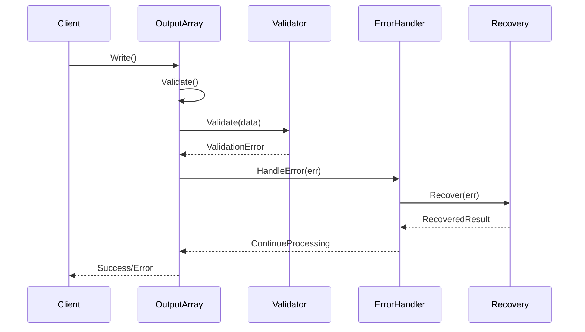
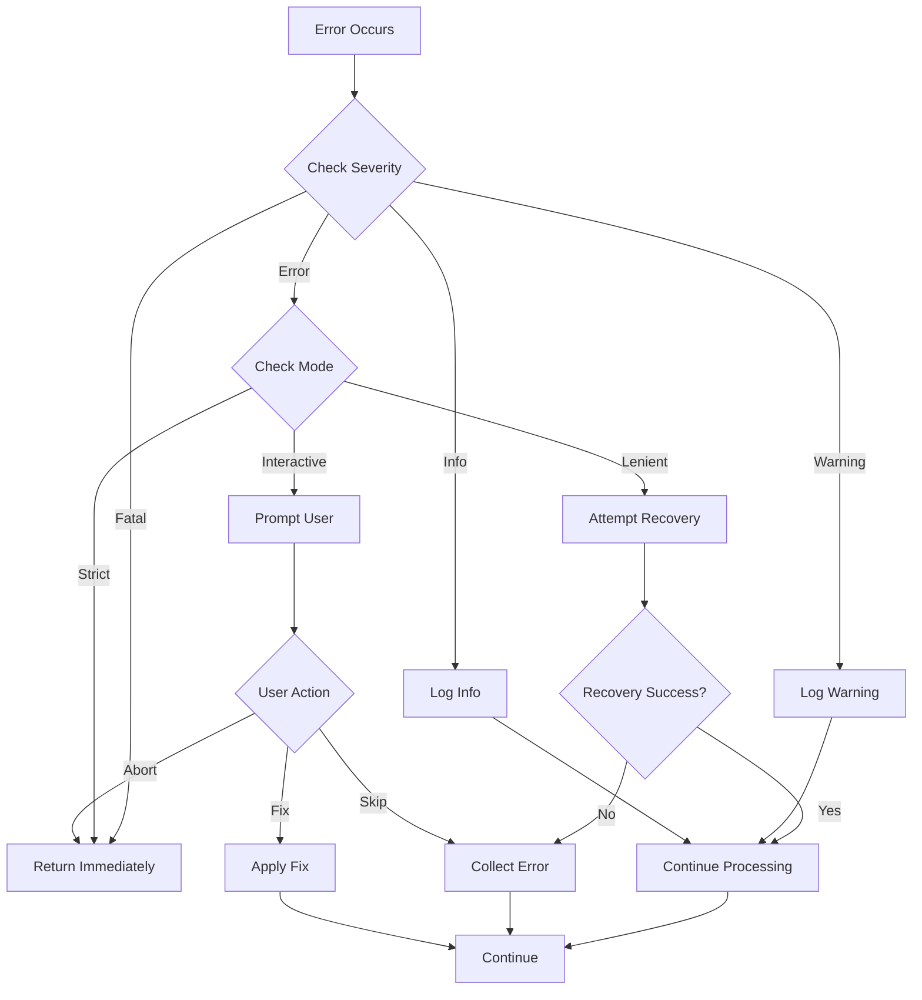

# Design Document

## Overview

The Error Handling and Validation system will replace the current `log.Fatal()` approach with a comprehensive error management framework. The system consists of three main components: a Validation Framework for pre-execution checks, an Error Registry for structured error types and formatting, and a Recovery Engine for automatic error recovery and fallback strategies.

The design prioritizes backward compatibility while providing modern error handling capabilities including detailed error context, structured error codes, recovery strategies, and multiple error handling modes (strict, lenient, interactive).

## Architecture

### High-Level Architecture

```
┌─────────────────────────────────────────────┐
│           Error Management System            │
├─────────────────┬─────────────┬────────────┤
│   Validation    │    Error    │  Recovery  │
│   Framework     │   Registry  │   Engine   │
├─────────────────┼─────────────┼────────────┤
│  Validators     │  Error Types │  Handlers  │
│  Rules Engine   │  Formatters  │  Strategies│
│  Constraints    │  Context     │  Fallbacks │
└─────────────────┴─────────────┴────────────┘
```

### Component Interaction Flow



## Components and Interfaces

### Core Error Interfaces

#### OutputError Interface Hierarchy
```go
// OutputError is the base error interface
type OutputError interface {
    error
    Code() ErrorCode
    Severity() ErrorSeverity
    Context() ErrorContext
    Suggestions() []string
    Wrap(error) OutputError
}

// ValidationError for validation failures
type ValidationError interface {
    OutputError
    Violations() []Violation
    IsComposite() bool
}

// ProcessingError for runtime failures
type ProcessingError interface {
    OutputError
    Retryable() bool
    PartialResult() interface{}
}
```

#### Validation Error Implementation
```go
type validationError struct {
    baseError
    violations []Violation
}

func (v *validationError) Error() string {
    var b strings.Builder
    b.WriteString(v.baseError.Error())
    
    if len(v.violations) > 0 {
        b.WriteString("\nValidation violations:\n")
        for _, violation := range v.violations {
            fmt.Fprintf(&b, "  - %s: %s (value: %v)\n", 
                violation.Field, violation.Message, violation.Value)
        }
    }
    
    return b.String()
}
```

#### Error Type System
```go
type ErrorCode string

const (
    // Configuration errors (1xxx)
    ErrInvalidFormat      ErrorCode = "OUT-1001"
    ErrMissingRequired    ErrorCode = "OUT-1002"
    ErrIncompatibleConfig ErrorCode = "OUT-1003"
    ErrInvalidFilePath    ErrorCode = "OUT-1004"
    
    // Validation errors (2xxx)
    ErrMissingColumn      ErrorCode = "OUT-2001"
    ErrInvalidDataType    ErrorCode = "OUT-2002"
    ErrConstraintViolation ErrorCode = "OUT-2003"
    ErrEmptyDataset       ErrorCode = "OUT-2004"
    
    // Processing errors (3xxx)
    ErrFileWrite          ErrorCode = "OUT-3001"
    ErrS3Upload           ErrorCode = "OUT-3002"
    ErrTemplateRender     ErrorCode = "OUT-3003"
    ErrMemoryExhausted    ErrorCode = "OUT-3004"
)

type ErrorSeverity int

const (
    SeverityFatal ErrorSeverity = iota
    SeverityError
    SeverityWarning
    SeverityInfo
)
```

### Validation Framework

#### Validator Interface
```go
type Validator interface {
    Validate(subject interface{}) error
    Name() string
}

type ValidatorFunc func(interface{}) error

func (f ValidatorFunc) Validate(subject interface{}) error {
    return f(subject)
}
```

#### Built-in Validators
```go
// RequiredColumnsValidator validates required columns exist
type RequiredColumnsValidator struct {
    columns []string
}

func (v *RequiredColumnsValidator) Validate(subject interface{}) error {
    output, ok := subject.(*OutputArray)
    if !ok {
        return NewValidationError(ErrInvalidDataType, "expected OutputArray")
    }
    
    missing := []string{}
    for _, required := range v.columns {
        found := false
        for _, key := range output.Keys {
            if key == required {
                found = true
                break
            }
        }
        if !found {
            missing = append(missing, required)
        }
    }
    
    if len(missing) > 0 {
        return NewValidationError(ErrMissingColumn, 
            "missing required columns").
            WithViolations(missing...)
    }
    
    return nil
}

// DataTypeValidator validates column data types
type DataTypeValidator struct {
    columnTypes map[string]reflect.Type
}

// ConstraintValidator for custom constraints
type ConstraintValidator struct {
    constraints []Constraint
}

type Constraint interface {
    Check(row map[string]interface{}) error
    Description() string
}
```

### Error Handler System

#### Error Handler Interface
```go
type ErrorHandler interface {
    HandleError(err error) error
    SetMode(mode ErrorMode)
}

type ErrorMode int

const (
    ErrorModeStrict ErrorMode = iota
    ErrorModeLenient
    ErrorModeInteractive
)
```

#### Default Error Handler Implementation
```go
type DefaultErrorHandler struct {
    mode            ErrorMode
    errors          []error
    warningHandler  func(error)
    recoveryHandler RecoveryHandler
}

func (h *DefaultErrorHandler) HandleError(err error) error {
    outputErr, ok := err.(OutputError)
    if !ok {
        outputErr = WrapError(err)
    }
    
    switch h.mode {
    case ErrorModeStrict:
        return h.handleStrict(outputErr)
    case ErrorModeLenient:
        return h.handleLenient(outputErr)
    case ErrorModeInteractive:
        return h.handleInteractive(outputErr)
    }
    
    return err
}

func (h *DefaultErrorHandler) handleStrict(err OutputError) error {
    if err.Severity() >= SeverityError {
        return err
    }
    
    if h.warningHandler != nil {
        h.warningHandler(err)
    }
    
    return nil
}

func (h *DefaultErrorHandler) handleLenient(err OutputError) error {
    h.errors = append(h.errors, err)
    
    if err.Severity() == SeverityFatal {
        return err
    }
    
    // Try recovery for non-fatal errors
    if h.recoveryHandler != nil {
        if recovered := h.recoveryHandler.Recover(err); recovered != nil {
            return nil
        }
    }
    
    return nil
}
```

### Recovery System

#### Recovery Handler Interface
```go
type RecoveryHandler interface {
    Recover(err OutputError) error
    CanRecover(err OutputError) bool
}

type RecoveryStrategy interface {
    Apply(err OutputError, context interface{}) (interface{}, error)
    ApplicableFor(err OutputError) bool
}
```

#### Built-in Recovery Strategies
```go
// FormatFallbackStrategy falls back to simpler formats
type FormatFallbackStrategy struct {
    fallbackChain []string // e.g., ["table", "csv", "json"]
}

func (s *FormatFallbackStrategy) Apply(err OutputError, context interface{}) (interface{}, error) {
    settings, ok := context.(*OutputSettings)
    if !ok {
        return nil, fmt.Errorf("invalid context for format fallback")
    }
    
    currentIdx := -1
    for i, format := range s.fallbackChain {
        if format == settings.OutputFormat {
            currentIdx = i
            break
        }
    }
    
    if currentIdx >= 0 && currentIdx < len(s.fallbackChain)-1 {
        settings.OutputFormat = s.fallbackChain[currentIdx+1]
        return settings, nil
    }
    
    return nil, fmt.Errorf("no fallback format available")
}

// DefaultValueStrategy provides defaults for missing values
type DefaultValueStrategy struct {
    defaults map[string]interface{}
}

// RetryStrategy for transient errors
type RetryStrategy struct {
    maxAttempts int
    backoff     BackoffStrategy
    retryable   func(error) bool
}
```

## Data Models

### Error Context Model
```go
type ErrorContext struct {
    Operation   string                 // The operation being performed
    Field       string                 // The field that caused the error
    Value       interface{}            // The problematic value
    Index       int                    // Index in array/slice if applicable
    Metadata    map[string]interface{} // Additional context information
}
```

### Violation Model
```go
type Violation struct {
    Field       string      // Field name that violated constraint
    Value       interface{} // The violating value
    Constraint  string      // Name of the violated constraint
    Message     string      // Human-readable violation message
}
```

### Error Summary Model
```go
type ErrorSummary struct {
    TotalErrors   int                        // Total number of errors
    ByCategory    map[ErrorCode]int          // Errors grouped by error code
    BySeverity    map[ErrorSeverity]int      // Errors grouped by severity
    Suggestions   []string                   // Aggregated suggestions
    FixableErrors int                        // Number of automatically fixable errors
}
```

### Base Error Implementation
```go
type baseError struct {
    code        ErrorCode
    severity    ErrorSeverity
    message     string
    context     ErrorContext
    suggestions []string
    cause       error
}

func (e *baseError) Error() string {
    var b strings.Builder
    fmt.Fprintf(&b, "[%s] %s", e.code, e.message)
    
    if e.context.Field != "" {
        fmt.Fprintf(&b, " (field: %s)", e.context.Field)
    }
    
    if len(e.suggestions) > 0 {
        fmt.Fprintf(&b, "\nSuggestions:\n")
        for _, s := range e.suggestions {
            fmt.Fprintf(&b, "  - %s\n", s)
        }
    }
    
    if e.cause != nil {
        fmt.Fprintf(&b, "\nCaused by: %v", e.cause)
    }
    
    return b.String()
}
```

### OutputArray Integration

#### Enhanced OutputArray with Error Handling
```go
type OutputArray struct {
    Settings      *OutputSettings
    Contents      []OutputHolder
    Keys          []string
    validators    []Validator
    errorHandler  ErrorHandler
}

// Validate runs all validators
func (o *OutputArray) Validate() error {
    // Settings validation
    if err := o.Settings.Validate(); err != nil {
        return err
    }
    
    // Format-specific validation
    if err := o.validateForFormat(); err != nil {
        return err
    }
    
    // Data validation
    for _, validator := range o.validators {
        if err := validator.Validate(o); err != nil {
            return o.handleError(err)
        }
    }
    
    return nil
}

// Write with error handling
func (o *OutputArray) Write() error {
    // Validate first
    if err := o.Validate(); err != nil {
        return err
    }
    
    // Stop any active progress
    stopActiveProgress()
    
    // Generate output
    result, err := o.generate()
    if err != nil {
        return o.handleError(err)
    }
    
    // Write output
    if err := o.writeOutput(result); err != nil {
        return o.handleError(err)
    }
    
    return nil
}

// AddValidator adds a custom validator
func (o *OutputArray) AddValidator(v Validator) {
    o.validators = append(o.validators, v)
}

// WithErrorHandler sets a custom error handler
func (o *OutputArray) WithErrorHandler(h ErrorHandler) *OutputArray {
    o.errorHandler = h
    return o
}
```

#### OutputSettings Validation
```go
func (s *OutputSettings) Validate() error {
    errors := NewCompositeError()
    
    // Validate output format
    if !s.isValidFormat() {
        errors.Add(NewValidationError(
            ErrInvalidFormat,
            fmt.Sprintf("invalid output format: %s", s.OutputFormat),
        ).WithSuggestions(
            fmt.Sprintf("Valid formats: %s", strings.Join(validFormats, ", ")),
        ))
    }
    
    // Validate format-specific requirements
    switch s.OutputFormat {
    case "mermaid":
        if s.FromToColumns == nil && s.MermaidSettings == nil {
            errors.Add(NewConfigError(
                ErrMissingRequired,
                "mermaid format requires FromToColumns or MermaidSettings",
            ).WithSuggestions(
                "Use AddFromToColumns() to set source and target columns",
                "Or configure MermaidSettings for chart generation",
            ))
        }
    case "dot":
        if s.FromToColumns == nil {
            errors.Add(NewConfigError(
                ErrMissingRequired,
                "dot format requires FromToColumns configuration",
            ))
        }
    }
    
    // Validate file output
    if s.OutputFile != "" {
        if err := s.validateOutputFile(); err != nil {
            errors.Add(err)
        }
    }
    
    // Validate S3 configuration
    if s.S3Bucket.Bucket != "" {
        if err := s.validateS3Config(); err != nil {
            errors.Add(err)
        }
    }
    
    return errors.ErrorOrNil()
}
```

### Error Reporting System

#### Error Reporter Interface
```go
type ErrorReporter interface {
    Report(err OutputError)
    Summary() ErrorSummary
}
```

#### Structured Error Output
```go
func (e *baseError) MarshalJSON() ([]byte, error) {
    return json.Marshal(struct {
        Code        ErrorCode         `json:"code"`
        Severity    string           `json:"severity"`
        Message     string           `json:"message"`
        Context     ErrorContext     `json:"context,omitempty"`
        Suggestions []string         `json:"suggestions,omitempty"`
        Cause       string           `json:"cause,omitempty"`
    }{
        Code:        e.code,
        Severity:    e.severity.String(),
        Message:     e.message,
        Context:     e.context,
        Suggestions: e.suggestions,
        Cause:       e.causeString(),
    })
}
```

### Usage Examples

#### Basic Error Handling
```go
func main() {
    settings := format.NewOutputSettings()
    settings.SetOutputFormat("json")
    
    output := format.OutputArray{
        Settings: settings,
        Keys:     []string{"Name", "Value"},
    }
    
    // Add data...
    
    // New error-returning API
    if err := output.Write(); err != nil {
        // Handle error appropriately
        fmt.Fprintf(os.Stderr, "Error: %v\n", err)
        
        // Check if it's an OutputError for more details
        if outErr, ok := err.(format.OutputError); ok {
            for _, suggestion := range outErr.Suggestions() {
                fmt.Fprintf(os.Stderr, "Try: %s\n", suggestion)
            }
        }
        os.Exit(1)
    }
}
```

#### Advanced Validation
```go
// Custom validation
output.AddValidator(format.ValidatorFunc(func(o interface{}) error {
    out := o.(*format.OutputArray)
    for _, holder := range out.Contents {
        if val, ok := holder.Contents["Price"].(float64); ok {
            if val < 0 {
                return format.NewValidationError(
                    format.ErrConstraintViolation,
                    "negative price not allowed",
                ).WithContext(format.ErrorContext{
                    Field: "Price",
                    Value: val,
                })
            }
        }
    }
    return nil
}))

// Validate before processing
if err := output.Validate(); err != nil {
    // Handle validation errors
}
```

#### Lenient Mode with Recovery
```go
settings.ErrorMode = format.ErrorModeLenient
settings.RecoveryStrategies = []format.RecoveryStrategy{
    format.NewFormatFallbackStrategy("table", "csv", "json"),
    format.NewDefaultValueStrategy(map[string]interface{}{
        "Status": "Unknown",
        "Count":  0,
    }),
}

output := format.OutputArray{Settings: settings}

// Will attempt recovery instead of failing
err := output.Write()
if err != nil {
    // Only fatal errors reach here
}

// Check for warnings/recovered errors
if summary := output.ErrorSummary(); summary.TotalErrors > 0 {
    fmt.Printf("Completed with %d errors\n", summary.TotalErrors)
}
```

## Error Handling

### Error Handling Modes

#### Strict Mode (Default)
- Fails fast on any error with severity >= Error
- Returns detailed error immediately
- No partial output generated
- Warnings are logged but don't stop processing

#### Lenient Mode
- Continues processing on recoverable errors
- Collects all errors for batch reporting
- Attempts recovery strategies for non-fatal errors
- Provides partial output where possible
- Reports all issues at completion

#### Interactive Mode
- Prompts user for error resolution
- Offers automatic fixes where available
- Allows retry with corrections
- Provides guided error resolution

### Error Processing Pipeline



### Backward Compatibility

#### Legacy Mode Support
```go
// LegacyErrorHandler mimics old log.Fatal behavior
type LegacyErrorHandler struct{}

func (h *LegacyErrorHandler) HandleError(err error) error {
    if err != nil {
        log.Fatal(err)
    }
    return nil
}

// EnableLegacyMode for backward compatibility
func (o *OutputArray) EnableLegacyMode() {
    o.errorHandler = &LegacyErrorHandler{}
}
```

#### Migration Helper Methods
```go
// WriteCompat provides backward-compatible Write method
func (o *OutputArray) WriteCompat() {
    if err := o.Write(); err != nil {
        log.Fatal(err)
    }
}
```

## Testing Strategy

### Unit Testing Approach

#### Error Type Testing
- Test error creation and formatting
- Verify error code assignments
- Test error context preservation
- Validate suggestion generation

#### Validation Testing
- Test each validator independently
- Test validator composition
- Test validation error aggregation
- Test custom validator integration

#### Error Handler Testing
- Test each error handling mode
- Test error handler switching
- Test recovery strategy execution
- Test error collection and reporting

#### Recovery Strategy Testing
- Test format fallback chains
- Test default value substitution
- Test retry mechanisms with backoff
- Test recovery strategy composition

### Integration Testing

#### End-to-End Error Flows
- Test complete error handling pipeline
- Test error propagation through system
- Test recovery and continuation scenarios
- Test backward compatibility modes

#### Performance Testing
- Validate error handling overhead < 1%
- Test memory allocation patterns
- Test lazy error message generation
- Test validation performance impact

### Error Simulation Testing
```go
// Test helper for error injection
type ErrorInjector struct {
    errors map[string]error
}

func (e *ErrorInjector) InjectError(operation string, err error) {
    e.errors[operation] = err
}

// Mock validators for testing
type MockValidator struct {
    shouldFail bool
    errorToReturn error
}

func (m *MockValidator) Validate(subject interface{}) error {
    if m.shouldFail {
        return m.errorToReturn
    }
    return nil
}
```

### Test Coverage Requirements
- Minimum 90% code coverage for error handling components
- 100% coverage for error type creation and formatting
- Complete coverage of all error codes and severities
- Full coverage of recovery strategy execution paths