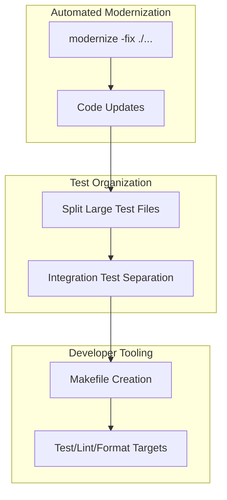

# Code Cleanup and Tooling Design

## Overview

This design document outlines the comprehensive approach for modernizing the go-output v2 codebase, improving test organization, and enhancing developer tooling. The implementation leverages Go 1.24.3 features through the `modernize` tool, reorganizes tests according to current best practices, and provides a robust Makefile for streamlined development workflows.

The modernization will be performed entirely through the `modernize` tool with its `-fix` flag, ensuring consistent and automated application of improvements across 118 identified optimization opportunities. The project already uses Go 1.24.3 as specified in the go.mod file.

## Architecture

### Modernization Strategy

The modernization follows a three-layer approach:



### Code Modernization Categories

Based on the modernize tool analysis, the following categories of improvements will be applied:

1. **Performance Optimizations**
   - Replace `[]byte(fmt.Sprintf...)` with `fmt.Appendf` (3 occurrences)
   - Replace manual map copying loops with `maps.Copy` (16 occurrences)
   - Use `slices.Contains` instead of manual loops (10 occurrences)
   - Use `strings.SplitSeq` for more efficient iteration (1 occurrence)

2. **Modern Go 1.24 Idioms**
   - Use `max` builtin for if statements (4 occurrences)
   - Use `range over int` for numeric loops (78 occurrences)
   - Convert benchmarks to use `b.Loop()` pattern (10 occurrences) - new in Go 1.24

3. **Code Simplification**
   - Simplify loops using modern iteration patterns
   - Leverage new builtin functions for cleaner code

## Components and Interfaces

### Test Organization Structure

#### Integration Test Separation

Tests will be separated using environment variables rather than build tags:

```go
// integration_test.go
func skipIfNotIntegration(t *testing.T) {
    if os.Getenv("INTEGRATION") != "1" {
        t.Skip("Skipping integration test (set INTEGRATION=1 to run)")
    }
}

func TestIntegrationFeature(t *testing.T) {
    skipIfNotIntegration(t)
    // Integration test code
}
```

#### Large Test File Splitting Strategy

Files exceeding 800 lines will be split by logical functionality, with each resulting file targeted at 600-800 lines maximum:

```
Original: pipeline_test.go (2652 lines)
Split to:
  - pipeline_filter_test.go (filter operations, ~600 lines)
  - pipeline_sort_test.go (sorting operations, ~500 lines)
  - pipeline_aggregate_test.go (aggregation operations, ~700 lines)
  - pipeline_transform_test.go (transformation operations, ~600 lines)
  - pipeline_validation_test.go (validation and error cases, ~250 lines)

Original: renderer_test.go (2640 lines)
Split to:
  - renderer_json_test.go (JSON rendering tests, ~600 lines)
  - renderer_yaml_test.go (YAML rendering tests, ~500 lines)
  - renderer_html_test.go (HTML rendering tests, ~700 lines)
  - renderer_markdown_test.go (Markdown rendering tests, ~800 lines)
```

Note: Files will be split based on actual logical boundaries in the code, not forced to fit exact line counts. If a logical unit would result in a file over 800 lines, it will be further subdivided.

### Makefile Architecture

The Makefile will provide a comprehensive set of targets organized by category:

```makefile
# Testing targets
test:              # Run unit tests
test-integration:  # Run integration tests
test-all:          # Run all tests
test-coverage:     # Generate coverage report

# Code quality targets
lint:              # Run golangci-lint
fmt:               # Format all code
modernize:         # Apply modernize fixes
check:             # Run fmt, lint, and tests

# Development targets
mod-tidy:          # Tidy Go modules
benchmark:         # Run benchmarks
clean:             # Clean generated files

# Help system
help:              # Display target documentation
```

## Data Models

### Test Configuration

```go
// TestConfig holds test execution configuration
type TestConfig struct {
    RunIntegration bool   // Set from INTEGRATION env var
    Verbose        bool   // Set from test flags
    Coverage       bool   // Set from coverage flags
}
```

### Benchmark Modernization Pattern

The new Go 1.24 `b.Loop()` pattern will replace all `for i := 0; i < b.N; i++` constructs. This feature, introduced in Go 1.24, provides automatic timer management and prevents compiler optimizations from affecting benchmark results:

```go
// Before (Go 1.23 and earlier)
func BenchmarkOld(b *testing.B) {
    for i := 0; i < b.N; i++ {
        // benchmark code
    }
}

// After (Go 1.24+)
func BenchmarkNew(b *testing.B) {
    for b.Loop() {
        // benchmark code
    }
}
```

## Error Handling

### Modernization Error Strategy

1. **Pre-flight Checks**
   - Verify all tests pass before modernization
   - Ensure working directory is clean (no uncommitted changes)
   - Check Go version compatibility (1.24+)

2. **Post-modernization Validation**
   - Run `go fmt` on all modified files
   - Execute full test suite
   - Run golangci-lint to catch any new issues

3. **Rollback Capability**
   - Git diff review before committing
   - Staged commits for incremental review
   - Clear documentation of changes in commit messages

## Testing Strategy

### Unit Testing

1. **Test File Organization**
   - Keep test files adjacent to source files
   - Use descriptive test names with `Test` prefix
   - Apply `got`/`want` naming convention

2. **Table-Driven Tests**
   ```go
   tests := map[string]struct {
       name     string
       input    any
       want     any
       wantErr  bool
   }{
       "valid input": {
           input: "test",
           want:  "TEST",
       },
       "empty input": {
           input:   "",
           wantErr: true,
       },
   }
   ```

### Integration Testing

1. **Environment-Based Execution**
   - Use `INTEGRATION=1` environment variable
   - Clear skip messages for non-integration runs
   - Separate make targets for clarity

2. **Test Isolation**
   - Each integration test creates its own test environment
   - Cleanup deferred to ensure resource release
   - No shared state between tests

### Performance Testing

1. **Benchmark Organization**
   - Group related benchmarks together
   - Use sub-benchmarks for variations
   - Include memory allocation benchmarks

2. **Modern Benchmark Pattern**
   ```go
   func BenchmarkFeature(b *testing.B) {
       b.Run("small", func(b *testing.B) {
           data := generateSmallData()
           b.ResetTimer()
           for b.Loop() {
               processData(data)
           }
       })
       b.Run("large", func(b *testing.B) {
           data := generateLargeData()
           b.ResetTimer()
           for b.Loop() {
               processData(data)
           }
       })
   }
   ```

## Implementation Phases

### Phase 1: Automated Modernization (Immediate)

1. **Execute Modernize Tool**
   ```bash
   cd v2
   modernize -fix ./...
   go fmt ./...
   ```

2. **Verify Changes**
   - Review git diff for unexpected changes
   - Run full test suite
   - Execute golangci-lint

3. **Update Examples**
   ```bash
   for dir in v2/examples/*/; do
       (cd "$dir" && modernize -fix ./... && go fmt ./...)
   done
   ```

### Phase 2: Test Reorganization

1. **Split Large Test Files**
   - pipeline_test.go → split by operation type
   - renderer_test.go → split by renderer type
   - operations_test.go → split by operation category
   - errors_test.go → split by error type
   - progress_test.go → split by progress feature

2. **Implement Integration Test Separation**
   - Add skipIfNotIntegration helper
   - Mark existing integration tests
   - Update documentation

### Phase 3: Makefile Creation

1. **Core Targets Implementation**
   ```makefile
   .PHONY: test
   test:
       @echo "Running unit tests..."
       @cd v2 && go test ./...

   .PHONY: test-integration
   test-integration:
       @echo "Running integration tests..."
       @cd v2 && INTEGRATION=1 go test ./...

   .PHONY: fmt
   fmt:
       @echo "Formatting v2 code..."
       @cd v2 && go fmt ./...
       @echo "Formatting examples..."
       @for dir in v2/examples/*/; do \
           echo "  Formatting $$dir"; \
           (cd "$$dir" && go fmt ./...); \
       done
   ```

2. **Advanced Targets**
   - Coverage generation with HTML output
   - Benchmark execution with comparison
   - Clean target for test cache and generated files

### Phase 4: Documentation Updates

1. **Update CLAUDE.md**
   - Add new make commands
   - Document test separation strategy
   - Include modernization notes

2. **Update README**
   - Add development workflow section
   - Include quick start for contributors
   - Document testing strategy

## Performance Considerations

### Modernization Impact

The modernize tool changes will provide measurable performance improvements:

1. **Memory Efficiency**
   - `maps.Copy` reduces allocations compared to manual loops
   - `fmt.Appendf` avoids intermediate string allocations
   - `slices.Contains` uses optimized implementation

2. **CPU Efficiency**
   - Native builtin functions are compiler-optimized
   - Range over int avoids bounds checking overhead
   - Modern patterns enable better compiler optimizations

3. **Benchmark Accuracy**
   - `b.Loop()` prevents compiler optimizations from skewing results
   - Automatic timer management reduces measurement noise
   - Better support for sub-benchmark comparisons

### Test Execution Performance

1. **Parallel Test Execution**
   - Tests marked with `t.Parallel()` where safe
   - Integration tests run sequentially to avoid conflicts
   - Benchmark tests isolated from parallel execution

2. **Test Caching**
   - Go test cache utilized for unchanged tests
   - Clean target available for cache invalidation
   - Coverage tests always bypass cache

## Security Considerations

### Code Quality Assurance

1. **Automated Validation**
   - All changes applied through vetted tools
   - No manual code modifications in Phase 1
   - Comprehensive test coverage before and after

2. **Review Process**
   - Git diff review for all automated changes
   - Staged commits for incremental validation
   - CI/CD pipeline validation

## Migration Path

### For Contributors

1. **Immediate Changes**
   - Use make commands instead of direct go commands
   - Run `make check` before committing
   - Use `INTEGRATION=1 make test` for full validation

2. **Test Writing Guidelines**
   - Follow new test organization patterns
   - Use environment variables for test categories
   - Apply modern Go idioms in new code

### Backward Compatibility

All changes maintain complete API compatibility:
- No public API changes
- No behavioral changes
- Performance improvements are transparent
- Go 1.24.3 is already the project's minimum version per go.mod

## Design Decisions and Rationales

### Use of modernize Tool

**Decision**: Apply all modernize suggestions automatically with `-fix` flag

**Rationale**: 
- Ensures consistent application of improvements
- Reduces human error in manual changes
- Leverages community-vetted optimization patterns
- Provides measurable performance benefits

### Environment Variable for Integration Tests

**Decision**: Use `INTEGRATION=1` instead of build tags

**Rationale**:
- Simpler to use and understand
- Better IDE support
- Easier to configure in CI/CD
- Aligns with Go community best practices for 2025

### Test File Splitting Threshold

**Decision**: Split test files exceeding 800 lines, targeting 600-800 lines per resulting file

**Rationale**:
- Improves maintainability and navigation
- Enables parallel development
- Reduces merge conflicts
- Maintains reasonable file sizes for review
- Allows logical grouping without forcing unrelated tests together

### Makefile Over Scripts

**Decision**: Use Makefile for developer tooling

**Rationale**:
- Universal developer tool used across the industry
- Built-in dependency management
- Clear target documentation with help system
- Simple, well-understood approach
- Standard practice in Go projects

### Comprehensive make check Target

**Decision**: Provide single command for pre-commit validation

**Rationale**:
- Reduces cognitive load
- Ensures consistent validation
- Catches issues before CI/CD
- Improves developer experience

## Success Metrics

1. **Code Modernization**
   - All 118 modernize suggestions applied
   - Zero test failures after modernization
   - Improved benchmark performance metrics

2. **Test Organization**
   - All test files under 800 lines
   - Clear separation of unit and integration tests
   - Improved test execution time through parallelization

3. **Developer Experience**
   - Single command validation with `make check`
   - Reduced onboarding time for new contributors
   - Consistent development workflow across team

## Future Considerations

### Potential Enhancements

1. **Advanced Testing**
   - Fuzz testing integration
   - Property-based testing support
   - Mutation testing for coverage validation

2. **Tooling Extensions**
   - Pre-commit hooks integration
   - Automated changelog generation
   - Performance regression detection

3. **CI/CD Integration**
   - GitHub Actions workflow templates
   - Automated modernize checks
   - Performance benchmarking in CI

## Conclusion

This design provides a comprehensive approach to modernizing the go-output v2 codebase through the `modernize` tool, improved test organization, and enhanced developer experience via a Makefile. The implementation leverages Go 1.24.3 features that are already in use by the project. The phased approach ensures minimal disruption while delivering immediate value through performance improvements and better development workflows. All changes maintain complete API compatibility while establishing consistent development practices.