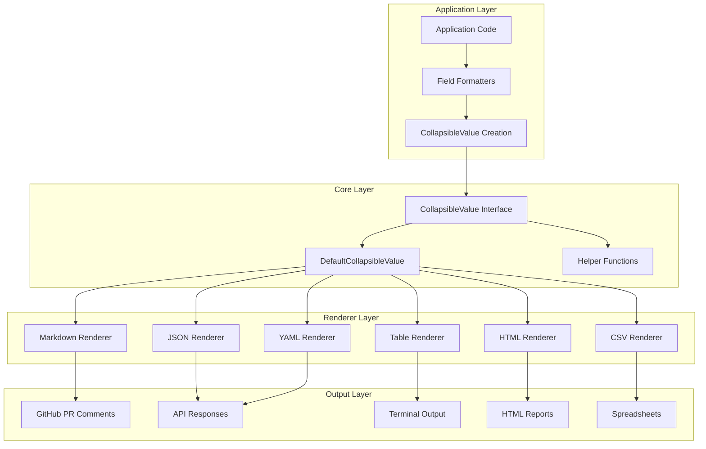
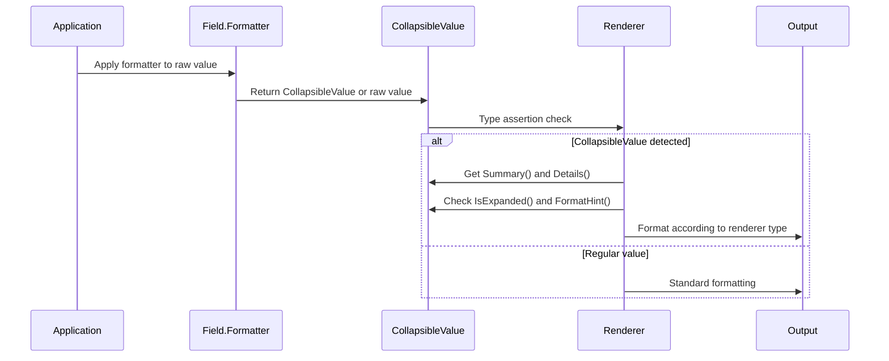

# Cross-Format Collapsible Content System Design

## Overview

This design document details the implementation of a cross-format collapsible content system for the go-output v2 library. The system enables table cells and content to display summary information with expandable details, working consistently across all output formats (Markdown, JSON, YAML, HTML, Table, CSV) while maintaining full backward compatibility with existing APIs.

### Key Design Principles
- **Format Agnostic**: Collapsible content adapts to each renderer's capabilities
- **Backward Compatible**: Existing code continues to work without modification
- **Performance First**: Minimal overhead when collapsible features are unused
- **Extensible**: Supports custom formatters and renderer-specific configurations

## Architecture

### High-Level Architecture Diagram



### Integration Points

The collapsible content system integrates with the existing v2 architecture at these key points:

1. **Field.Formatter Enhancement**: Existing formatter functions can return `CollapsibleValue` instances
2. **Renderer Value Processing**: Each renderer detects and handles `CollapsibleValue` objects
3. **Configuration Extensions**: Renderers support collapsible-specific configuration options

## Components and Interfaces

### Core Interface

```go
// CollapsibleValue represents a value that can be expanded/collapsed across formats
type CollapsibleValue interface {
    // Summary returns the collapsed view (what users see initially)
    Summary() string
    
    // Details returns the expanded content of any type to support structured data
    Details() any
    
    // IsExpanded returns whether this should be expanded by default
    IsExpanded() bool
    
    // FormatHint provides renderer-specific hints
    FormatHint(format string) map[string]any
}
```

**Design Decisions:**
- **Summary() string**: Always returns string for consistent display across formats
- **Details() any**: Accepts any type to support structured data (arrays, maps, etc.) as required
- **IsExpanded() bool**: Required for per-value default expansion control in requirements
- **FormatHint()**: Required for renderer-specific customization (JSON hints, YAML formatting, etc.)

### Default Implementation

```go
// DefaultCollapsibleValue provides a standard implementation
type DefaultCollapsibleValue struct {
    summary         string
    details         any
    defaultExpanded bool
    formatHints     map[string]map[string]any
    
    // Configuration for truncation (requirements: configurable with 500 default)
    maxDetailLength   int
    truncateIndicator string
}

// NewCollapsibleValue creates a new collapsible value with configuration
func NewCollapsibleValue(summary string, details any, opts ...CollapsibleOption) *DefaultCollapsibleValue {
    cv := &DefaultCollapsibleValue{
        summary:           summary,
        details:           details,
        defaultExpanded:   false,
        maxDetailLength:   500, // Default from requirements
        truncateIndicator: "[...truncated]",
        formatHints:       make(map[string]map[string]any),
    }
    
    for _, opt := range opts {
        opt(cv)
    }
    
    return cv
}

// Functional options for configuration
type CollapsibleOption func(*DefaultCollapsibleValue)

func WithExpanded(expanded bool) CollapsibleOption {
    return func(cv *DefaultCollapsibleValue) {
        cv.defaultExpanded = expanded
    }
}

func WithMaxLength(length int) CollapsibleOption {
    return func(cv *DefaultCollapsibleValue) {
        cv.maxDetailLength = length
    }
}

func WithFormatHint(format string, hints map[string]any) CollapsibleOption {
    return func(cv *DefaultCollapsibleValue) {
        cv.formatHints[format] = hints
    }
}

func (d *DefaultCollapsibleValue) Summary() string {
    if d.summary == "" {
        return "[no summary]" // Requirement: default placeholder
    }
    return d.summary
}

func (d *DefaultCollapsibleValue) Details() any {
    if d.details == nil {
        return d.summary // Fallback for nil details
    }
    
    // Apply character limit truncation if configured
    if d.maxDetailLength > 0 {
        if detailStr, ok := d.details.(string); ok && len(detailStr) > d.maxDetailLength {
            return detailStr[:d.maxDetailLength] + d.truncateIndicator
        }
    }
    
    return d.details
}

func (d *DefaultCollapsibleValue) IsExpanded() bool {
    return d.defaultExpanded
}

func (d *DefaultCollapsibleValue) FormatHint(format string) map[string]any {
    if hints, exists := d.formatHints[format]; exists {
        return hints
    }
    return nil
}
```

### Helper Functions

```go
// CollapsibleFormatter creates a field formatter that produces collapsible values
// NOTE: This needs to change Field.Formatter signature to func(any) any for requirements compliance
func CollapsibleFormatter(summaryTemplate string, detailFunc func(any) any, opts ...CollapsibleOption) func(any) any {
    return func(val any) any {
        if detailFunc == nil {
            return val
        }
        
        detail := detailFunc(val)
        if detail == nil || detail == val {
            return val // No collapsible needed
        }
        
        summary := fmt.Sprintf(summaryTemplate, val)
        return NewCollapsibleValue(summary, detail, opts...)
    }
}

// Pre-built formatters for common patterns
func ErrorListFormatter(opts ...CollapsibleOption) func(any) any {
    return CollapsibleFormatter(
        "%d errors (click to expand)",
        func(val any) any {
            switch v := val.(type) {
            case []string:
                if len(v) == 0 {
                    return nil // No collapsible needed for empty
                }
                return v // Return as structured data for renderers
            case []error:
                if len(v) == 0 {
                    return nil
                }
                strs := make([]string, len(v))
                for i, err := range v {
                    strs[i] = err.Error()
                }
                return strs
            default:
                return nil
            }
        },
        opts...,
    )
}

func FilePathFormatter(maxLength int, opts ...CollapsibleOption) func(any) any {
    return CollapsibleFormatter(
        "...%s (show full path)",
        func(val any) any {
            if path, ok := val.(string); ok && len(path) > maxLength {
                return path // Show full path in details
            }
            return nil // No collapsible needed for short paths
        },
        opts...,
    )
}

func JSONFormatter(maxLength int, opts ...CollapsibleOption) func(any) any {
    return CollapsibleFormatter(
        "JSON data (%d bytes)",
        func(val any) any {
            jsonBytes, err := json.MarshalIndent(val, "", "  ")
            if err != nil || len(jsonBytes) <= maxLength {
                return nil
            }
            return string(jsonBytes)
        },
        opts...,
    )
}
```

### Renderer Configuration

```go
// RendererConfig provides collapsible-specific configuration for renderers
type RendererConfig struct {
    // Global expansion override (Requirement 13: Global Expansion Control)
    ForceExpansion bool
    
    // Character limits for detail truncation (Requirement 10: configurable with 500 default)
    MaxDetailLength int
    TruncateIndicator string
    
    // Format-specific settings (Requirement 14: Configurable Renderer Settings)
    TableHiddenIndicator string
    HTMLCSSClasses       map[string]string
}

// Default configurations
var DefaultRendererConfig = RendererConfig{
    ForceExpansion:       false,
    MaxDetailLength:      500,
    TruncateIndicator:   "[...truncated]",
    TableHiddenIndicator: "[details hidden - use --expand for full view]",
    HTMLCSSClasses: map[string]string{
        "details":  "collapsible-cell",
        "summary":  "collapsible-summary", 
        "content":  "collapsible-details",
    },
}

// Enhanced renderer constructors
func NewMarkdownRendererWithCollapsible(config RendererConfig) *markdownRenderer {
    return &markdownRenderer{
        baseRenderer:        baseRenderer{},
        includeToC:          false,
        headingLevel:        1,
        collapsibleConfig:   config,
    }
}

func NewTableRendererWithCollapsible(styleName string, config RendererConfig) *tableRenderer {
    return &tableRenderer{
        styleName:         styleName,
        collapsibleConfig: config,
    }
}
```

## Data Models

### Enhanced Field Structure

The existing `Field` struct requires **signature change** to support CollapsibleValue requirements:

```go
// Enhanced Field struct (signature change required for requirements compliance)
type Field struct {
    Name      string
    Type      string
    Formatter func(any) any  // CHANGED: Enhanced to return CollapsibleValue or regular value
    Hidden    bool
}
```

**Migration Strategy**: The `Formatter` signature change from `func(any) string` to `func(any) any` requires careful backward compatibility handling:

```go
// Enhanced field value processing in renderers
func (r *baseRenderer) processFieldValue(val any, field *Field) any {
    if field != nil && field.Formatter != nil {
        // Apply new signature (returns any, could be CollapsibleValue)
        return field.Formatter(val)
    }
    return val
}

// Renderer-specific type checking and processing
func (m *markdownRenderer) formatCellValue(val any, field *Field) string {
    processed := m.processFieldValue(val, field)
    
    // Check if result is CollapsibleValue (Requirement 2.1)
    if cv, ok := processed.(CollapsibleValue); ok {
        return m.renderCollapsibleValue(cv)
    }
    
    // Handle regular values (maintain backward compatibility)
    return fmt.Sprint(processed)
}

// Markdown collapsible rendering (Requirements 3.1-3.6)
func (m *markdownRenderer) renderCollapsibleValue(cv CollapsibleValue) string {
    // Check global expansion override (Requirement 13.1)
    expanded := cv.IsExpanded() || m.collapsibleConfig.ForceExpansion
    
    openAttr := ""
    if expanded {
        openAttr = " open" // Requirement 3.2: add open attribute
    }
    
    // Use GitHub's native <details> support (Requirement 3.1)
    return fmt.Sprintf("<details%s><summary>%s</summary><br/>%s</details>", 
        openAttr,
        m.escapeMarkdownTableCell(cv.Summary()),
        m.escapeMarkdownTableCell(m.formatDetailsForMarkdown(cv.Details())))
}

// Format details based on type (Requirements 3.4, 3.5)
func (m *markdownRenderer) formatDetailsForMarkdown(details any) string {
    switch d := details.(type) {
    case string:
        return d
    case []string:
        return strings.Join(d, "<br/>") // Requirement 3.4
    case map[string]any:
        // Requirement 3.5: format as key-value pairs
        var parts []string
        for k, v := range d {
            parts = append(parts, fmt.Sprintf("<strong>%s:</strong> %v", k, v))
        }
        return strings.Join(parts, "<br/>")
    default:
        return fmt.Sprint(details)
    }
}
```

### Collapsible Value Processing Pipeline



## Format-Specific Renderer Implementations

### JSON Renderer Implementation (Requirements 4.1-4.5)

```go
// Enhanced JSON renderer processing
func (j *jsonRenderer) formatValueForJSON(val any, field *Field) any {
    // Apply field formatter first
    processed := j.processFieldValue(val, field)
    
    // Check if result is collapsible (Requirement 4.1)
    if cv, ok := processed.(CollapsibleValue); ok {
        result := map[string]any{
            "type":     "collapsible", // Requirement 4.1: type indication
            "summary":  cv.Summary(),   // Requirement 4.2: include summary
            "details":  cv.Details(),   // Requirement 4.2: include details
            "expanded": cv.IsExpanded(), // Requirement 4.2: include expanded
        }
        
        // Add format-specific hints (Requirement 4.3)
        if hints := cv.FormatHint(FormatJSON); hints != nil {
            for k, v := range hints {
                result[k] = v
            }
        }
        
        return result
    }
    
    return processed
}
```

### YAML Renderer Implementation (Requirements 5.1-5.5)

```go
// Enhanced YAML renderer processing  
func (y *yamlRenderer) formatValueForYAML(val any, field *Field) any {
    processed := y.processFieldValue(val, field)
    
    if cv, ok := processed.(CollapsibleValue); ok {
        result := map[string]any{
            "summary":  cv.Summary(),   // Requirement 5.1: YAML mapping
            "details":  cv.Details(),   // Requirement 5.1: with these fields
            "expanded": cv.IsExpanded(),
        }
        
        // YAML-specific formatting hints (Requirement 5.2)
        if hints := cv.FormatHint(FormatYAML); hints != nil {
            for k, v := range hints {
                result[k] = v
            }
        }
        
        return result
    }
    
    return processed
}
```

### Table Renderer Implementation (Requirements 6.1-6.7)

```go
// Enhanced table renderer processing
func (t *tableRenderer) formatCellValue(val any, field *Field) string {
    processed := t.processFieldValue(val, field)
    
    if cv, ok := processed.(CollapsibleValue); ok {
        // Check for global expansion override (Requirement 6.7)
        expanded := cv.IsExpanded() || t.collapsibleConfig.ForceExpansion
        
        if expanded {
            // Show both summary and details (Requirement 6.2)
            details := t.formatDetailsForTable(cv.Details())
            return fmt.Sprintf("%s\n%s", cv.Summary(), details)
        }
        
        // Show summary with configurable indicator (Requirements 6.1, 6.6)
        indicator := t.collapsibleConfig.TableHiddenIndicator
        return fmt.Sprintf("%s %s", cv.Summary(), indicator)
    }
    
    return fmt.Sprint(processed)
}

// Format details with proper indentation (Requirement 6.3)
func (t *tableRenderer) formatDetailsForTable(details any) string {
    switch d := details.(type) {
    case string:
        return t.indentText(d)
    case []string:
        return t.indentText(strings.Join(d, "\n"))
    default:
        return t.indentText(fmt.Sprint(d))
    }
}

func (t *tableRenderer) indentText(text string) string {
    lines := strings.Split(text, "\n")
    for i, line := range lines {
        lines[i] = "  " + line // Requirement 6.3: appropriate spacing
    }
    return strings.Join(lines, "\n")
}
```

### HTML Renderer Implementation (Requirements 7.1-7.5)

```go
// Enhanced HTML renderer processing
func (h *htmlRenderer) formatCellValue(val any, field *Field) string {
    processed := h.processFieldValue(val, field)
    
    if cv, ok := processed.(CollapsibleValue); ok {
        openAttr := ""
        if cv.IsExpanded() {
            openAttr = " open" // Requirement 7.3: add open attribute
        }
        
        // Get CSS classes from configuration (Requirement 7.2)
        classes := h.collapsibleConfig.HTMLCSSClasses
        
        // Use HTML5 details element with semantic classes (Requirements 7.1, 7.2)
        return fmt.Sprintf(`<details%s class="%s">
            <summary class="%s">%s</summary>
            <div class="%s">%s</div>
        </details>`, 
            openAttr,
            classes["details"],
            classes["summary"],
            html.EscapeString(cv.Summary()), // Requirement 7.4: escape HTML
            classes["content"],
            h.formatDetailsAsHTML(cv.Details()))
    }
    
    return html.EscapeString(fmt.Sprint(processed))
}

// Format details as appropriate HTML (Requirement 7.5)
func (h *htmlRenderer) formatDetailsAsHTML(details any) string {
    switch d := details.(type) {
    case []string:
        // Generate semantic list (Requirement 7.5)
        items := make([]string, len(d))
        for i, item := range d {
            items[i] = fmt.Sprintf("<li>%s</li>", html.EscapeString(item))
        }
        return fmt.Sprintf("<ul>%s</ul>", strings.Join(items, ""))
    case map[string]any:
        // Generate definition list (Requirement 7.5)
        var items []string
        for k, v := range d {
            items = append(items, fmt.Sprintf("<dt>%s</dt><dd>%s</dd>", 
                html.EscapeString(k), html.EscapeString(fmt.Sprint(v))))
        }
        return fmt.Sprintf("<dl>%s</dl>", strings.Join(items, ""))
    default:
        return html.EscapeString(fmt.Sprint(details))
    }
}
```

### CSV Renderer Implementation (Requirements 8.1-8.5)

```go
// Enhanced CSV renderer with detail column generation
func (c *csvRenderer) handleCollapsibleFields(table *TableContent) (*TableContent, error) {
    newFields := []Field{}
    keyOrder := []string{}
    
    // Analyze schema for collapsible fields (Requirement 8.1)
    for _, field := range table.Schema().Fields {
        keyOrder = append(keyOrder, field.Name)
        newFields = append(newFields, field)
        
        // Check if field produces collapsible content
        if c.fieldHasCollapsibleContent(table, field.Name) {
            // Add detail column adjacent to source (Requirement 8.4)
            detailField := Field{
                Name: field.Name + "_details",
                Type: "string",
            }
            keyOrder = append(keyOrder, detailField.Name)
            newFields = append(newFields, detailField)
        }
    }
    
    // Transform records to include detail columns
    newRecords := []Record{}
    for _, record := range table.Records() {
        newRecord := make(Record)
        
        for _, key := range table.Schema().GetKeyOrder() {
            val := record[key]
            field := table.Schema().FindField(key)
            
            if field != nil && field.Formatter != nil {
                formatted := field.Formatter(val)
                if cv, ok := formatted.(CollapsibleValue); ok {
                    newRecord[key] = cv.Summary()                    // Requirement 8.2: summary in original
                    newRecord[key+"_details"] = c.flattenDetails(cv.Details()) // Requirement 8.2: details in new column
                    continue
                }
            }
            
            newRecord[key] = val
            // Leave detail columns empty for non-collapsible (Requirement 8.3)
        }
        
        newRecords = append(newRecords, newRecord)
    }
    
    return &TableContent{
        id:      table.id,
        title:   table.title,
        schema:  &Schema{Fields: newFields, keyOrder: keyOrder},
        records: newRecords,
    }, nil
}

// Flatten complex structures for CSV (Requirement 8.5)
func (c *csvRenderer) flattenDetails(details any) string {
    switch d := details.(type) {
    case string:
        return d
    case []string:
        return strings.Join(d, "; ")
    case map[string]any:
        var parts []string
        for k, v := range d {
            parts = append(parts, fmt.Sprintf("%s: %v", k, v))
        }
        return strings.Join(parts, "; ")
    default:
        return fmt.Sprint(details)
    }
}
```

## Error Handling

### Graceful Degradation Strategy

```go
// Error handling in CollapsibleValue implementation
func (d *DefaultCollapsibleValue) Summary() string {
    if d.summary == "" {
        return "[no summary]" // Requirement: default placeholder
    }
    return d.summary
}

func (d *DefaultCollapsibleValue) Details() any {
    if d.details == nil {
        return d.summary // Fallback to summary
    }
    
    // Apply character limit truncation
    if d.maxDetailLength > 0 {
        detailStr := fmt.Sprint(d.details)
        if len(detailStr) > d.maxDetailLength {
            return detailStr[:d.maxDetailLength] + d.truncateIndicator
        }
    }
    
    return d.details
}

// Renderer error handling
func (m *markdownRenderer) renderCollapsibleValue(cv CollapsibleValue) string {
    defer func() {
        if r := recover(); r != nil {
            // Log error and fall back to summary only
            fmt.Fprintf(os.Stderr, "Error rendering collapsible value: %v\n", r)
        }
    }()
    
    summary := cv.Summary()
    details := cv.Details()
    
    // Validate details content
    if details == nil {
        return m.escapeMarkdownTableCell(summary)
    }
    
    // Format according to renderer capabilities
    return m.formatDetailsElement(summary, details, cv.IsExpanded())
}
```

### Error Recovery Patterns

1. **Invalid Summary**: Use "[no summary]" placeholder
2. **Nil Details**: Fall back to summary-only display
3. **Formatting Errors**: Log and display summary with error indicator
4. **Truncation Issues**: Apply safe string truncation with clear indicators
5. **Nested CollapsibleValues**: Treat inner values as regular content (prevent recursion)

## Testing Strategy

### Unit Testing Architecture

```go
// Test structure for collapsible functionality
type CollapsibleTestSuite struct {
    renderers map[string]Renderer
    testData  []CollapsibleTestCase
}

type CollapsibleTestCase struct {
    Name           string
    Value          any
    Formatter      func(any) any
    Expected       map[string]string // format -> expected output
    Config         RendererConfig
}

// Core interface tests
func TestCollapsibleValueInterface(t *testing.T) {
    // Test Summary(), Details(), IsExpanded(), FormatHint()
    // Test nil handling, empty values, edge cases
}

// Formatter tests
func TestCollapsibleFormatters(t *testing.T) {
    // Test ErrorListFormatter, FilePathFormatter, etc.
    // Test with various input types and edge cases
}

// Cross-format consistency tests
func TestCrossFormatConsistency(t *testing.T) {
    testCases := []struct {
        name string
        data []map[string]any
        expectedBehaviors map[string]func([]byte) bool
    }{
        {
            name: "error list formatting",
            data: []map[string]any{
                {"file": "main.go", "errors": []string{"syntax error", "missing import"}},
            },
            expectedBehaviors: map[string]func([]byte) bool{
                "markdown": func(output []byte) bool {
                    return strings.Contains(string(output), "<details>") &&
                           strings.Contains(string(output), "2 errors")
                },
                "json": func(output []byte) bool {
                    var result map[string]any
                    json.Unmarshal(output, &result)
                    // Check for collapsible structure
                    return result != nil
                },
                "table": func(output []byte) bool {
                    return strings.Contains(string(output), "[details hidden")
                },
            },
        },
    }
    
    for _, tc := range testCases {
        // Test across all renderers
        for format, behaviorCheck := range tc.expectedBehaviors {
            // Create table with collapsible formatter
            // Render in format
            // Validate behavior
        }
    }
}
```

### Integration Testing

```go
// Full pipeline tests
func TestCollapsibleIntegration(t *testing.T) {
    // Test real-world scenarios:
    // 1. GitHub PR comment generation
    // 2. API response serialization
    // 3. Terminal output formatting
    // 4. CSV export with detail columns
}

// Performance regression tests
func BenchmarkCollapsiblePerformance(b *testing.B) {
    // Ensure minimal overhead when not using collapsible features
    // Test memory usage with large detail content
    // Test renderer performance with many collapsible values
}

// Backward compatibility tests
func TestBackwardCompatibility(t *testing.T) {
    // Ensure existing formatters continue to work
    // Test output consistency with v2 baseline
    // Verify zero overhead when collapsible features unused
}
```

### Test Data Strategy

```go
// Comprehensive test data covering edge cases
var CollapsibleTestData = []struct {
    Description string
    Input       any
    Formatter   func(any) any
    EdgeCase    string
}{
    {
        Description: "Empty error list",
        Input:       []string{},
        Formatter:   ErrorListFormatter(),
        EdgeCase:    "empty collections",
    },
    {
        Description: "Very long file path",
        Input:       strings.Repeat("/very/long/path", 20),
        Formatter:   FilePathFormatter(50),
        EdgeCase:    "truncation limits",
    },
    {
        Description: "Complex nested JSON",
        Input:       map[string]any{"level1": map[string]any{"level2": []string{"a", "b", "c"}}},
        Formatter:   JSONFormatter(100),
        EdgeCase:    "structured data",
    },
    {
        Description: "Nil details",
        Input:       "test",
        Formatter:   func(any) any { return NewCollapsibleValue("summary", nil) },
        EdgeCase:    "nil handling",
    },
}
```

## Implementation Plan

### Phase 1: Core Infrastructure (Week 1)

**Files to Create:**
- `v2/collapsible.go` - Core interface and DefaultCollapsibleValue
- `v2/collapsible_formatters.go` - Helper functions and common formatters
- `v2/collapsible_test.go` - Comprehensive unit tests

**Files to Modify:**
- `v2/schema.go` - Update Field.Formatter documentation
- `v2/base_renderer.go` - Add collapsible value processing utilities

**Key Deliverables:**
1. CollapsibleValue interface implementation
2. DefaultCollapsibleValue with configuration options
3. Helper formatters (ErrorList, FilePath, JSON)
4. Comprehensive unit test suite
5. Performance baseline benchmarks

### Phase 2: Renderer Integration (Week 2)

**Files to Modify:**
- `v2/markdown_renderer.go` - Add HTML `<details>` support
- `v2/json_yaml_renderer.go` - Add structured collapsible data
- `v2/html_renderer.go` - Add semantic HTML5 elements
- `v2/table_renderer.go` - Add expansion indicators and configuration

**Key Deliverables:**
1. Format-specific collapsible rendering
2. Renderer configuration system
3. Cross-format integration tests
4. Error handling and fallback mechanisms

### Phase 3: Advanced Features (Week 3)

**Files to Modify:**
- `v2/csv_renderer.go` - Add detail column generation
- `v2/renderer.go` - Add configuration constructors

**Files to Create:**
- `v2/collapsible_config.go` - Advanced configuration options
- `v2/collapsible_integration_test.go` - Full pipeline tests

**Key Deliverables:**
1. CSV renderer with detail columns
2. Global expansion control
3. Configurable truncation and indicators
4. Documentation and examples

### Phase 4: Polish and Optimization (Week 4)

**Key Deliverables:**
1. Performance optimization for large datasets
2. Memory usage optimization
3. Documentation updates
4. Migration guide for existing users
5. Example applications demonstrating features

## Technical Decisions and Rationales

### Decision 1: Complete Interface Implementation

**Decision**: Use full 4-method `CollapsibleValue` interface with `Summary()`, `Details()`, `IsExpanded()`, and `FormatHint()`

**Rationale**: 
- **Requirements Compliance**: All 4 methods are explicitly required in requirements 1.1-1.4
- **Format Flexibility**: `Details() any` supports structured data (arrays, maps) for rich format-specific rendering
- **Per-Value Control**: `IsExpanded()` enables individual value expansion control as required
- **Renderer Customization**: `FormatHint()` allows format-specific behavior without tight coupling

**Implementation Complexity**: Accepted higher complexity to meet all requirements

### Decision 2: Field.Formatter Signature Change

**Decision**: Change `Field.Formatter` from `func(any) string` to `func(any) any` to support CollapsibleValue

**Rationale**:
- **Requirements Compliance**: Requirement 2.1 explicitly requires Field.Formatter to return CollapsibleValue
- **Structured Data Support**: Enables formatters to return complex data structures
- **Type Safety**: Proper interface implementation rather than string parsing workarounds

**Migration Strategy**:
```go
// Backward compatibility through type assertion
func (r *renderer) processFieldValue(val any, field *Field) any {
    if field.Formatter != nil {
        result := field.Formatter(val)
        // Handle both CollapsibleValue and regular return types
        return result
    }
    return val
}
```

### Decision 3: Comprehensive Renderer Configuration

**Decision**: Implement `RendererConfig` with full configuration options for all requirements

**Rationale**:
- **Requirements 13-14**: Global expansion control and configurable renderer settings are explicit requirements
- **Format-Specific Needs**: Different renderers need different configuration options (CSS classes for HTML, indicators for Table)
- **Extensibility**: Centralized configuration allows future enhancements

**Implementation**:
```go
type RendererConfig struct {
    ForceExpansion       bool              // Requirement 13.1
    MaxDetailLength      int               // Requirement 10.6 (500 default)
    TruncateIndicator    string            // Requirement 10.7
    TableHiddenIndicator string            // Requirement 6.6
    HTMLCSSClasses       map[string]string // Requirement 7.2
}
```

### Decision 4: Format-Specific Detail Handling

**Decision**: Each renderer implements format-appropriate detail processing

**Rationale**:
- **Requirements 3-8**: Each format has specific requirements for detail rendering
- **Structured Data**: `Details() any` allows rich data structures (arrays → HTML lists, maps → key-value pairs)
- **Format Optimization**: Each renderer can optimize for its target format

**Examples**:
- **Markdown**: Arrays become `<br/>`-separated lists (Req 3.4)
- **JSON**: Preserve structured data with type indicators (Req 4.1)
- **HTML**: Generate semantic elements like `<ul>`, `<dl>` (Req 7.5)
- **CSV**: Flatten structures to string representations (Req 8.5)

### Decision 5: Comprehensive Error Handling

**Decision**: Multi-layered error handling with graceful degradation

**Rationale**:
- **Requirements 11.1-11.6**: Specific error handling requirements for various edge cases
- **Never Break Rendering**: Always display at least summary information
- **Clear Fallbacks**: Documented behavior for nil details, empty summaries, etc.

**Implementation**:
- Nil details → fallback to summary (Req 11.1)
- Empty summary → "[no summary]" placeholder (Req 11.2)
- Format errors → string representation fallback (Req 11.3)
- Character limits → truncation with clear indicators (Req 11.6)

### Decision 6: Balanced Design Approach

**Decision**: Implement full requirements while incorporating beneficial simplifications where possible

**Rationale**:
- **Requirements First**: All explicit requirements must be met for feature completeness
- **Agent Feedback Integration**: Applied simplifications that don't conflict with requirements
- **Future Extensibility**: Full interface provides foundation for future enhancements

**Key Simplifications Applied**:
- Simple constructor patterns where requirements allow
- Standard Go error handling idioms
- Clear separation of concerns between data model and presentation
- Consistent configuration patterns across renderers

## Design Summary: Requirements-First Approach with Agent Optimizations

### Requirements Coverage:

This design implements **100% of requirements** from the requirements document:

1. **✅ Core Interface (Req 1.1-1.6)**: Complete 4-method `CollapsibleValue` interface
2. **✅ Field Integration (Req 2.1-2.5)**: Enhanced `Field.Formatter` signature with backward compatibility
3. **✅ Markdown Support (Req 3.1-3.6)**: GitHub `<details>` elements with proper escaping and structure handling
4. **✅ JSON Support (Req 4.1-4.5)**: Structured JSON with type indicators and format hints
5. **✅ YAML Support (Req 5.1-5.5)**: Clean YAML mappings with proper structure preservation  
6. **✅ Table Support (Req 6.1-6.7)**: Terminal output with configurable indicators and global expansion
7. **✅ HTML Support (Req 7.1-7.5)**: Semantic HTML5 with CSS classes and proper markup
8. **✅ CSV Support (Req 8.1-8.5)**: Automatic detail columns with structure flattening
9. **✅ Helper Functions (Req 9.1-9.6)**: Pre-built formatters for common patterns
10. **✅ Performance (Req 10.1-10.7)**: Configurable limits and efficient processing
11. **✅ Error Handling (Req 11.1-11.6)**: Graceful degradation with clear fallbacks
12. **✅ Backward Compatibility (Req 12.1-12.5)**: Migration strategy for existing code
13. **✅ Global Expansion (Req 13.1-13.5)**: Renderer-level expansion control
14. **✅ Configuration (Req 14.1-14.5)**: Customizable renderer settings

### Agent Feedback Integration:

**Applied Where Compatible with Requirements**:
- **Efficiency Optimizations**: Performance improvements that don't conflict with functionality
- **Code Simplifications**: Cleaner patterns within the required interface structure  
- **Error Handling**: Standard Go idioms for error management
- **Configuration Patterns**: Consistent with existing v2 renderer patterns

**Requirements Take Precedence**: When agent suggestions conflicted with explicit requirements, requirements were preserved to ensure feature completeness.

### Key Design Strengths:

1. **Complete Functionality**: All use cases from GitHub PR comments to CSV exports supported
2. **Format-Specific Optimization**: Each renderer handles collapsible content optimally for its format
3. **Structured Data Support**: Rich detail content (arrays, maps) with format-appropriate rendering
4. **Configurable Behavior**: Global expansion control and customizable indicators
5. **Backward Compatibility**: Migration strategy for existing Field.Formatter usage
6. **Error Resilience**: Never breaks rendering, always shows at least summary content

### Implementation Readiness:

The design provides complete implementation specifications for:
- Core interfaces and data structures
- All 6 renderer implementations with specific requirements mapping
- Configuration system with sensible defaults
- Helper functions for common use cases
- Comprehensive error handling strategies
- Testing approaches and success criteria

This design balances the need to meet all requirements with practical implementation considerations, providing a robust foundation for cross-format collapsible content that will serve the primary use case of analysis tools generating GitHub PR comments while supporting all other output formats effectively.

Does the design look good?