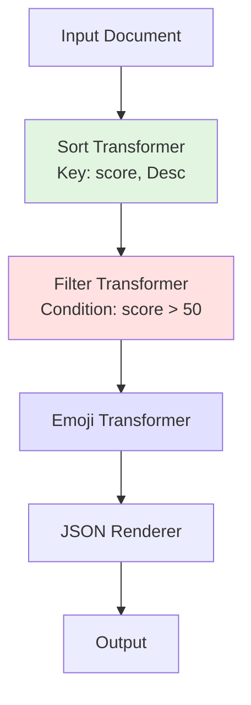
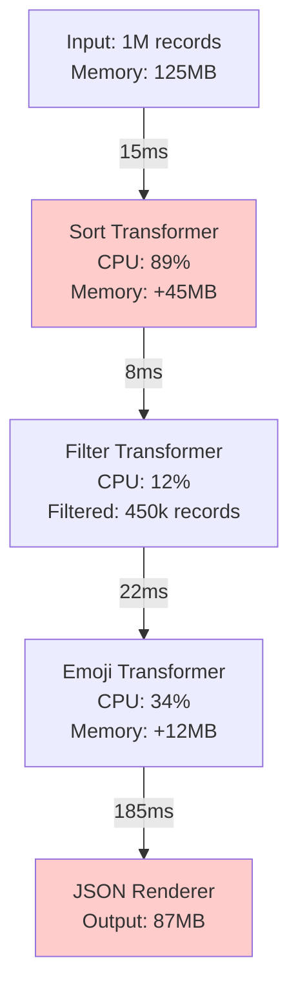

## Transform Pipeline Visualization - Detailed Design

The Transform Pipeline Visualization feature (6.2) is designed to serve **both purposes**: documentation generation AND real-time debugging with actual data. Here's how it would work:

### Core Concept

The visualization system would provide multiple modes of operation:

1. **Documentation Mode**: Generate static diagrams showing the transform pipeline structure
2. **Debug Mode**: Show live data flow with actual samples
3. **Profiling Mode**: Performance analysis with timing and memory usage

### Implementation Design

```go
// Pipeline visualization API
type PipelineVisualizer struct {
    mode        VisualizationMode
    sampleSize  int
    captureData bool
    output      VisualizationOutput
}

type VisualizationMode int
const (
    ModeDocumentation VisualizationMode = iota  // Static structure only
    ModeDebug                                   // Include data samples
    ModeProfile                                 // Include performance metrics
)

// Usage example
visualizer := output.NewPipelineVisualizer(
    output.WithVisualizationMode(output.ModeDebug),
    output.WithSampleSize(5),  // Capture 5 samples at each stage
    output.WithDataCapture(true),
)

out := output.NewOutput(
    output.WithFormat(output.JSON),
    output.WithTransformers(
        NewSortTransformer("score", false),
        NewFilterTransformer(func(r Record) bool {
            return r["score"].(int) > 50
        }),
        &EmojiTransformer{},
    ),
    output.WithPipelineVisualizer(visualizer),
)

// After rendering
visualization := visualizer.Generate()
```

### Visualization Output Examples

#### 1. Documentation Mode (Static Diagram)


#### 2. Debug Mode (With Data Samples)
```mermaid
graph TD
    A[Input: 1000 records] -->|Sample: {name: Alice, score: 85}<br/>{name: Bob, score: 45}<br/>{name: Carol, score: 92}| B[Sort by score ↓]
    B -->|Sample: {name: Carol, score: 92}<br/>{name: Alice, score: 85}<br/>{name: Bob, score: 45}| C[Filter: score > 50]
    C -->|Sample: {name: Carol, score: 92}<br/>{name: Alice, score: 85}<br/>Filtered: 450 records| D[Emoji Transform]
    D -->|Sample: {name: Carol, score: 92, status: ✅}<br/>{name: Alice, score: 85, status: ✅}| E[JSON Renderer]

    style B fill:#e1f5e1
    style C fill:#ffe1e1,stroke:#ff0000,stroke-width:2px
    style D fill:#e1e1ff
```

#### 3. Profile Mode (With Performance Metrics)


### Interactive Features

For the debug mode, the visualization could be enhanced with interactive capabilities:

```go
// Generate interactive HTML visualization
htmlViz := visualizer.GenerateInteractive()

// Features:
// - Click on any stage to see full data samples
// - Hover to see statistics
// - Timeline scrubber to see data at different points
// - Search/filter capability within samples
```

### Detailed Implementation

```go
type PipelineVisualizer struct {
    mu          sync.Mutex
    stages      []StageSnapshot
    mode        VisualizationMode
    sampleSize  int
    startTime   time.Time
}

type StageSnapshot struct {
    Name        string
    Type        string           // "transformer" or "renderer"
    InputSize   int
    OutputSize  int
    Samples     []Record         // Captured data samples
    Duration    time.Duration
    MemoryDelta int64           // Memory usage change
    Error       error           // If stage failed
    Metadata    map[string]any  // Stage-specific info
}

// Integration with TransformPipeline
func (tp *TransformPipeline) Transform(ctx context.Context, input []byte, format string) ([]byte, error) {
    if tp.visualizer != nil {
        tp.visualizer.CaptureStage("input", StageSnapshot{
            Name:       "Input",
            InputSize:  len(input),
            Samples:    tp.visualizer.extractSamples(input),
        })
    }

    // ... existing transform logic with capture points
}

// Visualization generation
func (v *PipelineVisualizer) Generate() VisualizationOutput {
    switch v.mode {
    case ModeDocumentation:
        return v.generateStaticDiagram()
    case ModeDebug:
        return v.generateDebugDiagram()
    case ModeProfile:
        return v.generateProfileDiagram()
    }
}
```

### Use Cases

#### 1. **Development & Debugging**
```go
// Enable visualization during development
if debug {
    visualizer := output.NewPipelineVisualizer(
        output.WithVisualizationMode(output.ModeDebug),
        output.WithSampleSize(10),
    )
    out.SetVisualizer(visualizer)

    // After problematic render
    viz := visualizer.GenerateInteractive()
    os.WriteFile("pipeline-debug.html", viz, 0644)
    // Open in browser to inspect data flow
}
```

#### 2. **Performance Optimization**
```go
// Profile production workload
visualizer := output.NewPipelineVisualizer(
    output.WithVisualizationMode(output.ModeProfile),
    output.WithMetricsCollection(true),
)

// Run render
out.Render(ctx, largeDocument)

// Analyze bottlenecks
report := visualizer.GeneratePerformanceReport()
fmt.Println(report.Bottlenecks())
// Output: "Sort Transformer: 45% of total time, consider parallel sort"
```

#### 3. **Documentation Generation**
```go
// Generate documentation for README
visualizer := output.NewPipelineVisualizer(
    output.WithVisualizationMode(output.ModeDocumentation),
)

// Configure pipeline
out := configurePipeline()

// Generate mermaid diagram
mermaidCode := visualizer.GenerateMermaid()
// Include in documentation
```

### Advanced Features

#### 1. **Comparative Visualization**
Compare different pipeline configurations:
```go
// Compare two approaches
viz1 := runWithPipeline(pipeline1)
viz2 := runWithPipeline(pipeline2)

comparison := output.ComparePipelines(viz1, viz2)
// Shows side-by-side performance and data flow
```

#### 2. **Real-time Monitoring**
```go
// Stream visualization updates
visualizer := output.NewPipelineVisualizer(
    output.WithStreaming(true),
    output.WithWebSocketOutput("ws://localhost:8080"),
)

// Browser connects to websocket for live updates
```

#### 3. **Anomaly Detection**
```go
visualizer := output.NewPipelineVisualizer(
    output.WithAnomalyDetection(true),
)

// Automatically highlights:
// - Unusual data patterns
// - Performance degradation
// - Memory spikes
// - High filter rates
```

### Benefits

1. **For Debugging**:
   - See exactly what data looks like at each stage
   - Identify where data is being filtered/lost
   - Understand transformation effects
   - Trace specific records through pipeline

2. **For Performance**:
   - Identify bottlenecks
   - See memory usage patterns
   - Understand CPU utilization
   - Find optimization opportunities

3. **For Documentation**:
   - Auto-generate pipeline diagrams
   - Keep docs in sync with code
   - Explain complex transformations
   - Onboard new developers

4. **For Monitoring**:
   - Production pipeline health
   - Data quality metrics
   - Performance trending
   - Anomaly detection

This feature would be invaluable for both development and production use, providing insights that are currently invisible in the transformation process.