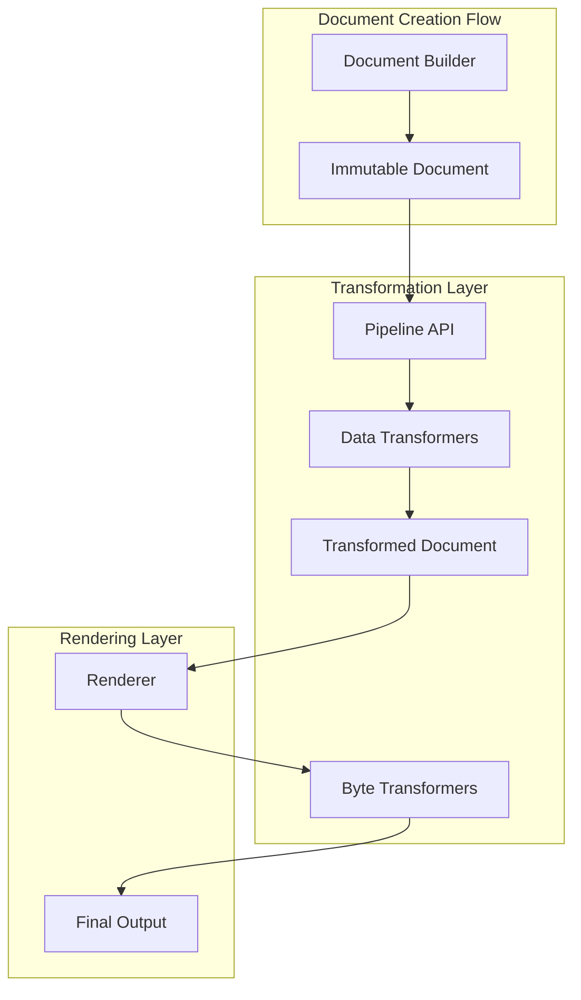

# Transformation Pipeline Enhancement Design

## Overview

The transformation pipeline enhancement extends the v2 architecture to support comprehensive data transformation capabilities while maintaining complete backward compatibility. This design introduces a dual-transformer system where data-level transformations operate on structured data before rendering, and byte-level transformations continue to provide post-rendering modifications.

The enhancement enables users to perform complex data operations through a fluent pipeline API, eliminating the need for manual data manipulation before document creation and avoiding expensive parse/render cycles that plague the current byte-only transformer approach.

## Architecture

### Core Components



### Transformer Hierarchy

The system implements two distinct transformer interfaces that operate at different stages:

1. **DataTransformer Interface** - Operates on structured data before rendering
2. **Transformer Interface** (existing) - Operates on rendered bytes

Both transformer types receive format context, enabling format-aware transformations while maintaining the separation of concerns between data manipulation and presentation.

### Pipeline Architecture

The Pipeline API provides a fluent interface for chaining data operations:

```go
transformedDoc := doc.Pipeline().
    Filter(func(r Record) bool { return r["status"] == "active" }).
    Sort("timestamp", Descending).
    Limit(100).
    AddColumn("duration", func(r Record) any { 
        return r["end_time"].(time.Time).Sub(r["start_time"].(time.Time))
    }).
    Execute()
```

Operations are collected and optimized before execution, enabling:
- Operation reordering for performance (e.g., filter before sort)
- Future parallel execution capabilities
- Query planning and optimization

## Components and Interfaces

### DataTransformer Interface

```go
// DataTransformer operates on structured data before rendering
type DataTransformer interface {
    // Name returns the transformer name for identification
    Name() string
    
    // TransformData modifies structured content data
    TransformData(ctx context.Context, content Content, format string) (Content, error)
    
    // CanTransform checks if this transformer applies to the given content and format
    CanTransform(content Content, format string) bool
    
    // Priority determines transform order (lower = earlier)
    Priority() int
    
    // Describe returns a human-readable description for debugging
    Describe() string
}
```

### Enhanced Transformer Detection

The renderer will implement intelligent transformer detection:

```go
// TransformerAdapter wraps transformers for unified handling
type TransformerAdapter interface {
    IsDataTransformer() bool
    AsDataTransformer() DataTransformer
    AsByteTransformer() Transformer
}
```

### Pipeline API Components

```go
// Pipeline provides fluent API for data transformations
type Pipeline struct {
    document   *Document
    operations []Operation
    options    PipelineOptions
}

// Operation represents a pipeline operation
type Operation interface {
    Name() string
    Apply(ctx context.Context, content Content) (Content, error)
    CanOptimize(with Operation) bool
}

// Core operations
type FilterOp struct {
    predicate func(Record) bool
}

type SortOp struct {
    keys       []SortKey
    comparator func(a, b Record) int
}

type AggregateOp struct {
    groupBy    []string
    aggregates map[string]AggregateFunc
}

// Validate checks if pipeline operations can be applied
func (p *Pipeline) Validate() error {
    // Check if document has transformable content
    hasTableContent := false
    for _, content := range p.document.GetContents() {
        if content.Type() == ContentTypeTable {
            hasTableContent = true
            break
        }
    }
    if !hasTableContent {
        return fmt.Errorf("pipeline operations require table content")
    }
    
    // Validate operation compatibility
    for _, op := range p.operations {
        if err := op.Validate(); err != nil {
            return fmt.Errorf("invalid operation %s: %w", op.Name(), err)
        }
    }
    return nil
}
```

### Schema Evolution Support

```go
// SchemaBuilder supports schema modification during transformation
type SchemaBuilder struct {
    base      *Schema
    newFields []Field
    keyOrder  []string
}

// AddField adds a new field to the schema
func (sb *SchemaBuilder) AddField(name string, field Field) *SchemaBuilder {
    // Validate field doesn't already exist
    if sb.base.HasField(name) {
        // Handle conflict appropriately
        return sb
    }
    sb.newFields = append(sb.newFields, field)
    sb.keyOrder = append(sb.keyOrder, name)
    return sb
}

// InsertField inserts a field at a specific position
func (sb *SchemaBuilder) InsertField(position int, name string, field Field) *SchemaBuilder {
    // Validate position bounds
    if position < 0 || position > len(sb.keyOrder) {
        // Handle invalid position
        return sb
    }
    // Preserve key order while inserting
    sb.newFields = append(sb.newFields, field)
    sb.keyOrder = append(sb.keyOrder[:position], 
        append([]string{name}, sb.keyOrder[position:]...)...)
    return sb
}

// Build creates the evolved schema with preserved key ordering
func (sb *SchemaBuilder) Build() *Schema {
    // Merge base and new fields while preserving order
    return &Schema{
        Fields:   append(sb.base.Fields, sb.newFields...),
        keyOrder: sb.keyOrder,
    }
}
```

## Data Models

### Transformation Context

```go
// TransformContext carries metadata through the transformation pipeline
type TransformContext struct {
    Format      string
    Document    *Document
    Metadata    map[string]any
    Stats       TransformStats
}

// TransformStats tracks transformation metrics
type TransformStats struct {
    InputRecords  int
    OutputRecords int
    FilteredCount int
    Duration      time.Duration
    Operations    []OperationStat
}
```

### Content Transformation

```go
// TransformableContent extends Content with transformation support
type TransformableContent interface {
    Content
    
    // Clone creates a deep copy for transformation
    Clone() Content
    
    // Transform applies a transformation function
    Transform(fn TransformFunc) error
}

// TransformFunc defines the transformation function signature
type TransformFunc func(data any) (any, error)
```

### Pipeline Results

```go
// PipelineResult encapsulates transformation results
type PipelineResult struct {
    Document *Document
    Stats    TransformStats
    Errors   []error
}
```

## Error Handling

### Fail-Fast Strategy

The pipeline implements fail-fast error handling as decided in the requirements:

```go
// PipelineError provides detailed error context
type PipelineError struct {
    Operation   string
    Stage       int
    Input       any
    Cause       error
    Context     map[string]any
}

func (e *PipelineError) Error() string {
    return fmt.Sprintf("pipeline failed at stage %d (%s): %v", 
        e.Stage, e.Operation, e.Cause)
}
```

### Error Recovery

While the system fails fast, it provides comprehensive error information:

1. **Operation Context**: Which operation failed
2. **Data Sample**: Sample of data that caused the failure
3. **Stage Information**: Position in the pipeline
4. **Stack Trace**: For debugging complex transformations

## Testing Strategy

### Unit Testing

1. **Interface Compliance**
   - Verify DataTransformer implementations
   - Test transformer detection logic
   - Validate operation interfaces

2. **Operation Testing**
   - Test each operation in isolation
   - Verify predicate functions
   - Test aggregation calculations

3. **Schema Evolution**
   - Test field addition/removal
   - Verify key order preservation
   - Test schema merging

### Integration Testing

1. **Pipeline Execution**
   - Test operation chaining
   - Verify optimization logic
   - Test error propagation

2. **Renderer Integration**
   - Test data transformer application
   - Verify byte transformer compatibility
   - Test format-specific behavior

3. **Backward Compatibility**
   - Ensure existing transformers work unchanged
   - Verify no performance regression
   - Test migration scenarios

### Performance Testing

1. **Benchmark Suite**
   - Measure transformation overhead
   - Test with various data sizes
   - Compare with manual manipulation

2. **Memory Profiling**
   - Track allocation patterns
   - Verify no memory leaks
   - Test with large datasets

## Implementation Phases

### Phase 1: Core Implementation

All main features will be implemented together as decided:

1. **DataTransformer Interface**
   - Define interface and adapter pattern
   - Implement transformer detection
   - Create base implementations

2. **Pipeline API**
   - Implement Pipeline() method on Document
   - Create operation interfaces
   - Build fluent API chain

3. **Core Operations**
   - Filter with predicates
   - Sort with multiple keys
   - Limit operation
   - GroupBy and aggregations
   - AddColumn for calculated fields

4. **Renderer Integration**
   - Modify renderers to detect transformer types
   - Apply transformers at appropriate stages
   - Maintain format context passing

5. **Documentation**
   - API documentation
   - Migration guide
   - Example cookbook

### Phase 2: Future Enhancements (If Needed)

Features explicitly deferred to future versions:
- Expression-based filter language
- Parallel execution optimizations  
- Transformation result caching
- Security sandboxing
- Cross-table joins
- Streaming support
- Window functions

## Addressing Complexity Concerns

### Why the Dual Transformer System is Necessary

The dual transformer approach is not arbitrary complexity but a necessary architectural decision driven by real requirements:

1. **Different Operational Contexts**
   - **Data transformers** operate on structured data (Records, Schemas) before rendering
   - **Byte transformers** operate on rendered output for format-specific styling
   - Example: Filtering records (data) vs. adding ANSI colors (bytes)

2. **Backward Compatibility Without Compromise**
   - Existing byte transformers continue working unchanged
   - No performance regression for current users
   - Gradual migration path without forced rewrites

3. **Clear Use Cases for Each Type**
   - **Data Transformers**: Filtering, sorting, aggregating, calculating fields
   - **Byte Transformers**: Adding colors, emoji conversion, format-specific styling
   - Users need both capabilities, not one or the other

### Pipeline API Justification

The Pipeline API provides value beyond simple convenience:

1. **Optimization Opportunities**
   ```go
   // Without pipeline: 3 data passes
   data = filterData(data)
   data = sortData(data)  
   data = limitData(data)
   
   // With pipeline: Optimized to 1-2 passes
   doc.Pipeline().Filter(...).Sort(...).Limit(...).Execute()
   ```

2. **Error Context**
   - Pipeline knows which operation failed and can provide detailed context
   - Manual operations lose this context

3. **Future Extensibility**
   - Enables features like caching, parallel execution, profiling
   - Manual approach locks users into specific implementation

### Type Safety Strategy

While the design uses `any` types in some places, type safety is maintained through:

1. **Runtime Type Checking**
   ```go
   func (f FilterOp) Apply(ctx context.Context, content Content) (Content, error) {
       // Type assertion with proper error handling
       tableContent, ok := content.(*TableContent)
       if !ok {
           return nil, fmt.Errorf("filter requires table content, got %T", content)
       }
       // Operation proceeds with type-safe tableContent
   }
   ```

2. **Validation Before Execution**
   - Pipeline.Validate() catches type issues before operations run
   - Clear error messages guide users to correct usage

3. **Generic Future**
   - Design accommodates future generic implementations when appropriate

## Design Decisions and Rationales

### Dual Transformer System

**Decision**: Maintain separate DataTransformer and Transformer interfaces

**Rationale**: 
- Provides complete backward compatibility
- Allows appropriate transformation at each stage
- Maintains clear separation of concerns
- Enables gradual migration path

### Immutable Transformation

**Decision**: Pipeline operations return new Document instances

**Rationale**:
- Consistent with v2's immutability principle
- Prevents unexpected side effects
- Enables transformation comparison
- Supports functional programming patterns

### Lazy Evaluation

**Decision**: Collect operations before execution

**Rationale**:
- Enables optimization opportunities
- Reduces data passes
- Allows future parallel execution
- Provides query planning capability

### Format Context Everywhere

**Decision**: Pass format information to all transformers

**Rationale**:
- Enables format-specific optimizations
- Allows adaptive transformer behavior
- Supports format-specific features
- Maintains consistency across transformer types

### Predicate-Based Filtering

**Decision**: Use Go functions instead of expression language

**Rationale**:
- Type-safe and compile-time checked
- Leverages Go's native capabilities
- Avoids DSL complexity
- Maintains library simplicity

## Resource Management and Safety

### Preventing Runaway Operations

Even though full sandboxing is deferred, basic safety measures are included:

1. **Operation Limits**
   ```go
   type PipelineOptions struct {
       MaxOperations    int           // Default: 100
       MaxExecutionTime time.Duration // Default: 30s
       MaxMemoryUsage   int64         // Future consideration
   }
   ```

2. **Context Cancellation**
   - All operations respect context.Context for cancellation
   - Timeouts automatically enforced through context

3. **Memory Bounds**
   - Document cloning uses copy-on-write where possible
   - Large dataset handling provides warnings

### Handling Mixed Content Types

The pipeline gracefully handles documents with mixed content:

```go
func (p *Pipeline) Execute() (*Document, error) {
    // Validate first
    if err := p.Validate(); err != nil {
        return nil, err
    }
    
    // Process only table content
    newContents := make([]Content, 0, len(p.document.GetContents()))
    for _, content := range p.document.GetContents() {
        if content.Type() == ContentTypeTable {
            // Apply transformations
            transformed, err := p.applyOperations(content)
            if err != nil {
                return nil, err
            }
            newContents = append(newContents, transformed)
        } else {
            // Pass through non-table content unchanged
            newContents = append(newContents, content)
        }
    }
    
    // Create new document with transformed contents
    return createDocumentWithContents(newContents, p.document.GetMetadata()), nil
}
```

## Performance Considerations

### Optimization Strategies

1. **Operation Reordering**
   - Apply filters before expensive operations
   - Combine compatible operations
   - Minimize data copies

2. **Memory Management**
   - Use object pools for temporary allocations
   - Stream large datasets when possible
   - Implement copy-on-write for schemas

3. **Caching Opportunities**
   - Cache schema detection results
   - Memoize expensive calculations
   - Reuse transformation results

### Performance Targets

Based on requirements and user feedback:
- Transformation overhead < 2x manual manipulation
- Handle 100-1000 records without noticeable delay
- Memory scaling proportional to data size
- No performance impact when disabled

## Security Considerations

While not required initially, the design accommodates future security enhancements:

1. **Resource Limits**
   - Maximum operation count
   - Memory usage caps
   - Execution timeouts

2. **Sandboxing**
   - Isolated execution contexts
   - Limited system access
   - Controlled function capabilities

3. **Validation**
   - Input sanitization
   - Type checking
   - Bounds verification

## Migration Path

### For Existing Users

1. **No Breaking Changes**
   - Existing code continues working
   - Current transformers remain valid
   - Performance characteristics maintained

2. **Gradual Adoption**
   - Start with simple pipeline operations
   - Migrate byte transformers to data transformers where appropriate
   - Leverage new capabilities incrementally

### Migration Examples

```go
// Before: Manual data manipulation
filtered := make([]Record, 0)
for _, record := range data {
    if record["status"] == "active" {
        filtered = append(filtered, record)
    }
}
sort.Slice(filtered, func(i, j int) bool {
    return filtered[i]["timestamp"].(time.Time).Before(
        filtered[j]["timestamp"].(time.Time))
})
doc := output.New().AddTable("Results", filtered).Build()

// After: Pipeline API
doc := output.New().AddTable("Results", data).Build()
transformedDoc := doc.Pipeline().
    Filter(func(r Record) bool { return r["status"] == "active" }).
    Sort("timestamp", Ascending).
    Execute()
```

## Conclusion

This design provides a comprehensive transformation pipeline that addresses all requirements while maintaining the core principles of the v2 architecture. The dual-transformer system ensures backward compatibility while enabling powerful new data manipulation capabilities. The pipeline API offers an intuitive interface for complex operations, and the fail-fast error handling provides clear feedback for debugging.

The phased implementation approach allows for immediate value delivery while keeping the door open for future enhancements based on user needs and feedback.