# Design Document: Go-Output v2.0 (Updated)

## Overview

This document outlines a complete v2.0 redesign of the go-output library leveraging Go 1.24 features. As a major version bump with a clean break from v1, we prioritize a modern, maintainable API while ensuring all v1 functionality remains available through new interfaces.

**Version**: v2.0.0
**Minimum Go Version**: 1.24

### Design Goals

1. **Clean API**: Remove legacy complexity and provide intuitive interfaces
2. **No Global State**: Complete elimination of global variables
3. **Type Safety**: Leverage generics for compile-time safety
4. **Feature Parity**: All v1 functionality available through new APIs
5. **Key Order Preservation**: Maintain exact user-specified key ordering
6. **Performance**: Use new Go 1.24 features for better efficiency
7. **Clear Migration**: Automated tools for v1 to v2 conversion

## Architecture

### High-Level Architecture

```mermaid
graph TB
    subgraph "Public API"
        D[Document]
        B[Builder]
        O[Output]
        P[Progress]
    end

    subgraph "Content System"
        C[Content Interface]
        TC[TableContent]
        TX[TextContent]
        RC[RawContent]
        SC[SectionContent]
    end

    subgraph "Schema System"
        S[Schema]
        F[Field]
        KO[KeyOrder]
    end

    subgraph "Rendering Pipeline"
        R[Renderer Interface]
        JR[JSONRenderer]
        TR[TableRenderer]
        CR[CSVRenderer]
        HR[HTMLRenderer]
        MR[MarkdownRenderer]
        YR[YAMLRenderer]
        DR[DOTRenderer]
        MER[MermaidRenderer]
        DI[DrawIORenderer]
    end

    subgraph "Transform System"
        T[Transformer Interface]
        ET[EmojiTransformer]
        CT[ColorTransformer]
        ST[SortTransformer]
        LT[LineSplitTransformer]
    end

    subgraph "Output Management"
        W[Writer Interface]
        FW[FileWriter]
        SW[StdoutWriter]
        S3W[S3Writer]
        MW[MultiWriter]
    end

    D --> B
    B --> C
    C --> S
    S --> KO
    O --> R
    O --> T
    O --> W
    P --> O
```



### Architectural Principles

1. **Interface-Driven**: All major components are interfaces
2. **Immutable Content**: Content objects are immutable after creation
3. **Order Preservation**: Key order is preserved exactly as specified
4. **Functional Options**: Configuration through option functions
5. **Context-Aware**: All operations support context for cancellation
6. **Zero Allocation**: Use append interfaces to minimize allocations
7. **Clean Break**: No v1 compatibility layer

## Components and Interfaces

### Core Content Interface

```go
package output

import (
    "context"
    "encoding"
    "io"
)

// ContentType identifies the type of content
type ContentType int

const (
    ContentTypeTable ContentType = iota
    ContentTypeText
    ContentTypeRaw
    ContentTypeSection
)

// Content is the core interface all content must implement
type Content interface {
    // Type returns the content type
    Type() ContentType

    // ID returns a unique identifier for this content
    ID() string

    // Encoding interfaces for efficient serialization
    encoding.TextAppender
    encoding.BinaryAppender
}
```

### Document and Builder

```go
// Document represents a collection of content to be output
type Document struct {
    contents []Content
    metadata map[string]interface{}
}

// Builder constructs documents with a fluent API
type Builder struct {
    doc *Document
}

// New creates a new document builder
func New() *Builder {
    return &Builder{
        doc: &Document{
            metadata: make(map[string]interface{}),
        },
    }
}

// Table adds a table with preserved key ordering
func (b *Builder) Table(title string, data interface{}, opts ...TableOption) *Builder {
    table := newTable(title, data, opts...)
    b.doc.contents = append(b.doc.contents, table)
    return b
}

// Text adds text content
func (b *Builder) Text(text string, opts ...TextOption) *Builder {
    txt := newText(text, opts...)
    b.doc.contents = append(b.doc.contents, txt)
    return b
}

// Raw adds format-specific raw content
func (b *Builder) Raw(format string, data []byte) *Builder {
    raw := &RawContent{
        id:     generateID(),
        format: format,
        data:   data,
    }
    b.doc.contents = append(b.doc.contents, raw)
    return b
}

// Section groups content under a heading
func (b *Builder) Section(title string, fn func(*Builder)) *Builder {
    section := &SectionContent{
        id:    generateID(),
        title: title,
    }

    // Create sub-builder for section contents
    subBuilder := &Builder{doc: &Document{}}
    fn(subBuilder)
    section.contents = subBuilder.doc.contents

    b.doc.contents = append(b.doc.contents, section)
    return b
}

// Header adds a header (for backward compatibility with v1 AddHeader)
func (b *Builder) Header(text string) *Builder {
    return b.Text(text, WithTextStyle(TextStyle{Header: true}))
}

// Build finalizes and returns the document
func (b *Builder) Build() *Document {
    return b.doc
}
```

### Table Content with Key Order Preservation

```go
// TableContent represents tabular data with preserved key ordering
type TableContent struct {
    id      string
    title   string
    schema  *Schema
    records []Record
}

// Schema defines table structure with explicit key ordering
type Schema struct {
    Fields   []Field
    keyOrder []string // Preserves exact key order
}

// Field defines a table field
type Field struct {
    Name      string
    Type      string
    Formatter func(interface{}) string
    Hidden    bool
}

// Record is a single table row
type Record map[string]interface{}

// TableOption configures table creation
type TableOption func(*tableConfig)

// WithSchema explicitly sets the table schema with key order
func WithSchema(fields ...Field) TableOption {
    return func(tc *tableConfig) {
        tc.schema = &Schema{
            Fields: fields,
            keyOrder: extractKeyOrder(fields),
        }
    }
}

// WithKeys sets explicit key ordering (for v1 compatibility)
func WithKeys(keys ...string) TableOption {
    return func(tc *tableConfig) {
        tc.keys = keys
    }
}

// extractKeyOrder preserves the exact order of fields
func extractKeyOrder(fields []Field) []string {
    keys := make([]string, 0, len(fields))
    for _, f := range fields {
        if !f.Hidden {
            keys = append(keys, f.Name)
        }
    }
    return keys
}

// Implementation of encoding.TextAppender preserving key order
func (t *TableContent) AppendText(b []byte) ([]byte, error) {
    // Headers in exact order from schema
    for i, key := range t.schema.keyOrder {
        if i > 0 {
            b = append(b, '\t')
        }
        b = append(b, key...)
    }
    b = append(b, '\n')

    // Records with values in same key order
    for _, record := range t.records {
        for i, key := range t.schema.keyOrder {
            if i > 0 {
                b = append(b, '\t')
            }
            if val, ok := record[key]; ok {
                field := t.findField(key)
                if field != nil && field.Formatter != nil {
                    b = append(b, field.Formatter(val)...)
                } else {
                    b = append(b, fmt.Sprint(val)...)
                }
            }
        }
        b = append(b, '\n')
    }

    return b, nil
}
```

### All Output Formats Support

```go
// Renderer converts a document to a specific format
type Renderer interface {
    // Format returns the output format name
    Format() string

    // Render converts the document to bytes
    Render(ctx context.Context, doc *Document) ([]byte, error)

    // RenderTo streams output to a writer
    RenderTo(ctx context.Context, doc *Document, w io.Writer) error

    // SupportsStreaming indicates if streaming is supported
    SupportsStreaming() bool
}

// Format represents an output format configuration
type Format struct {
    Name      string
    Renderer  Renderer
    Options   map[string]interface{}
}

// All v1 formats supported
var (
    JSON     = Format{Name: "json", Renderer: &jsonRenderer{}}
    YAML     = Format{Name: "yaml", Renderer: &yamlRenderer{}}
    CSV      = Format{Name: "csv", Renderer: &csvRenderer{}}
    HTML     = Format{Name: "html", Renderer: &htmlRenderer{}}
    Table    = Format{Name: "table", Renderer: &tableRenderer{}}
    Markdown = Format{Name: "markdown", Renderer: &markdownRenderer{}}
    DOT      = Format{Name: "dot", Renderer: &dotRenderer{}}
    Mermaid  = Format{Name: "mermaid", Renderer: &mermaidRenderer{}}
    DrawIO   = Format{Name: "drawio", Renderer: &drawioRenderer{}}
)

// Chart and diagram support for DOT, Mermaid, and Draw.io
type GraphContent struct {
    id    string
    title string
    edges []Edge
}

type Edge struct {
    From  string
    To    string
    Label string
}

// ChartContent for specialized chart types (Gantt, Pie, etc.)
type ChartContent struct {
    id       string
    title    string
    chartType string // "gantt", "pie", "flowchart"
    data     any     // Chart-specific data structure
}

// GanttTask represents a task in a Gantt chart
type GanttTask struct {
    ID          string
    Title       string
    StartDate   string
    EndDate     string
    Dependencies []string
    Status      string // "active", "done", "crit"
}

// PieSlice represents a slice in a pie chart
type PieSlice struct {
    Label string
    Value float64
}

// DrawIOContent represents Draw.io diagram data for CSV export
type DrawIOContent struct {
    id          string
    title       string
    header      DrawIOHeader
    records     []Record
}

// DrawIOHeader configures Draw.io CSV import behavior (v1 compatibility)
type DrawIOHeader struct {
    Label        string            // Node label with placeholders (%Name%)
    Style        string            // Node style with placeholders (%Image%)
    Ignore       string            // Columns to ignore in metadata
    Connections  []DrawIOConnection // Connection definitions
    Link         string            // Link column
    Layout       string            // Layout type (auto, horizontalflow, etc.)
    NodeSpacing  int              // Spacing between nodes
    LevelSpacing int              // Spacing between levels
    EdgeSpacing  int              // Spacing between edges
    Parent       string            // Parent column for hierarchical diagrams
    ParentStyle  string            // Style for parent nodes
    Height       string            // Node height
    Width        string            // Node width
    Padding      int              // Padding when auto-sizing
    Left         string            // X coordinate column
    Top          string            // Y coordinate column
    Identity     string            // Identity column
    Namespace    string            // Namespace prefix
}

// DrawIOConnection defines relationships between nodes
type DrawIOConnection struct {
    From   string // Source column
    To     string // Target column
    Invert bool   // Invert direction
    Label  string // Connection label
    Style  string // Connection style (curved, straight, etc.)
}

// GraphOption for configuring graph content
type GraphOption func(*graphConfig)

func WithFromTo(from, to string) GraphOption {
    return func(gc *graphConfig) {
        gc.fromColumn = from
        gc.toColumn = to
    }
}

// ChartOption for configuring chart content
type ChartOption func(*chartConfig)

func WithChartType(chartType string) ChartOption {
    return func(cc *chartConfig) {
        cc.chartType = chartType
    }
}

// DrawIOOption for configuring Draw.io content
type DrawIOOption func(*DrawIOHeader)

func WithDrawIOLayout(layout string) DrawIOOption {
    return func(h *DrawIOHeader) {
        h.Layout = layout
    }
}

func WithDrawIOSpacing(nodeSpacing, levelSpacing, edgeSpacing int) DrawIOOption {
    return func(h *DrawIOHeader) {
        h.NodeSpacing = nodeSpacing
        h.LevelSpacing = levelSpacing
        h.EdgeSpacing = edgeSpacing
    }
}

func WithDrawIOConnection(from, to, label, style string) DrawIOOption {
    return func(h *DrawIOHeader) {
        h.Connections = append(h.Connections, DrawIOConnection{
            From:  from,
            To:    to,
            Label: label,
            Style: style,
        })
    }
}
```

### Transform System with All v1 Features

```go
// Transformer modifies content or output
type Transformer interface {
    // Name returns the transformer name
    Name() string

    // Transform modifies the input bytes
    Transform(ctx context.Context, input []byte, format string) ([]byte, error)

    // CanTransform checks if this transformer applies
    CanTransform(format string) bool

    // Priority determines transform order (lower = earlier)
    Priority() int
}

// All v1 transformers
type EmojiTransformer struct{}
func (e *EmojiTransformer) Name() string { return "emoji" }
func (e *EmojiTransformer) Priority() int { return 100 }

type ColorTransformer struct {
    scheme ColorScheme
}
func (c *ColorTransformer) Name() string { return "color" }
func (c *ColorTransformer) Priority() int { return 200 }

type SortTransformer struct {
    key       string
    ascending bool
}
func (s *SortTransformer) Name() string { return "sort" }
func (s *SortTransformer) Priority() int { return 50 }

type LineSplitTransformer struct {
    separator string
}
func (l *LineSplitTransformer) Name() string { return "linesplit" }
func (l *LineSplitTransformer) Priority() int { return 150 }
```

### Progress Support with v1 Feature Parity

```go
// ProgressColor defines visual feedback colors (v1 compatibility)
type ProgressColor int

const (
    ProgressColorDefault ProgressColor = iota
    ProgressColorGreen   // Success state
    ProgressColorRed     // Error state  
    ProgressColorYellow  // Warning state
    ProgressColorBlue    // Informational state
)

// Progress provides progress indication for long operations with full v1 compatibility
type Progress interface {
    // Core progress methods
    SetTotal(total int)
    SetCurrent(current int)
    Increment(delta int)
    SetStatus(status string)
    Complete()
    Fail(err error)
    
    // v1 compatibility methods
    SetColor(color ProgressColor)
    IsActive() bool
    SetContext(ctx context.Context)
    
    // v2 enhancements
    Close() error
}

// ProgressOptions configures progress behavior (v1 compatibility)
type ProgressOptions struct {
    Color         ProgressColor
    Status        string
    TrackerLength int
    Writer        io.Writer
    UpdateInterval time.Duration
    ShowPercentage bool
    ShowETA       bool
    ShowRate      bool
}

// PrettyProgress uses go-pretty library for professional progress bars
type PrettyProgress struct {
    writer  progress.Writer
    tracker *progress.Tracker
    options ProgressOptions
    active  bool
    mutex   sync.Mutex
    ctx     context.Context
    signals chan os.Signal
}

// TextProgress provides simple text-based progress (fallback)
type TextProgress struct {
    config    *ProgressOptions
    mu        sync.RWMutex
    total     int
    current   int
    status    string
    startTime time.Time
    completed bool
    failed    bool
    err       error
}

// NoOpProgress implements no-operation progress (v1 compatibility)
type NoOpProgress struct {
    total   int
    current int
    options ProgressOptions
}

// NewProgress creates format-aware progress indicator (v1 compatibility)
func NewProgress(format string, opts ...ProgressOption) Progress {
    // Auto-select implementation based on format:
    // - PrettyProgress for table/html/markdown (if TTY detected)
    // - NoOpProgress for json/csv/yaml/dot
    // - TextProgress as fallback
}

// NewProgressForFormats creates progress for multiple output formats
func NewProgressForFormats(formats []Format, opts ...ProgressOption) Progress {
    // Smart selection based on format mix
}

// WithProgress adds progress tracking to output
func WithProgress(p Progress) Option {
    return func(o *Output) {
        o.progress = p
    }
}

// v1 Compatible options
func WithProgressColor(color ProgressColor) ProgressOption
func WithProgressStatus(status string) ProgressOption  
func WithTrackerLength(length int) ProgressOption

// v2 Enhanced options
func WithProgressWriter(w io.Writer) ProgressOption
func WithUpdateInterval(interval time.Duration) ProgressOption
func WithPercentage(show bool) ProgressOption
func WithETA(show bool) ProgressOption
func WithRate(show bool) ProgressOption
```

### Output Configuration with All v1 Features

```go
// Output manages rendering and writing
type Output struct {
    formats    []Format
    pipeline   *TransformPipeline
    writers    []Writer
    progress   Progress

    // v1 feature support
    tableStyle  string
    hasTOC      bool
    frontMatter map[string]string
}

// Option configures Output
type Option func(*Output)

// Table styling options (v1 compatibility)
func WithTableStyle(style string) Option {
    return func(o *Output) {
        o.tableStyle = style
    }
}

// TOC generation (v1 compatibility)
func WithTOC(enabled bool) Option {
    return func(o *Output) {
        o.hasTOC = enabled
    }
}

// Markdown front matter (v1 compatibility)
func WithFrontMatter(fm map[string]string) Option {
    return func(o *Output) {
        o.frontMatter = fm
    }
}
```

### Writer System with S3 Support

```go
// Writer outputs rendered data
type Writer interface {
    Write(ctx context.Context, format string, data []byte) error
}

// FileWriter writes to files with os.Root for security
type FileWriter struct {
    root     *os.Root
    pattern  string // e.g., "report-{format}.{ext}"
}

// S3Writer writes to S3 (v1 compatibility)
type S3Writer struct {
    client *s3.Client
    bucket string
    key    string
}

// NewS3Writer creates an S3 writer
func NewS3Writer(client *s3.Client, bucket, key string) *S3Writer {
    return &S3Writer{
        client: client,
        bucket: bucket,
        key:    key,
    }
}
```

### Table of Contents Implementation

```go
// MarkdownRenderer with TOC support
type markdownRenderer struct {
    frontMatter  map[string]string
    includeToC   bool
}

// generateTableOfContents creates a markdown table of contents from document sections
func (m *markdownRenderer) generateTableOfContents(doc *Document) string {
    var toc strings.Builder
    
    for _, content := range doc.Contents() {
        switch c := content.(type) {
        case *SectionContent:
            // Generate anchor-safe identifier
            anchor := m.generateAnchor(c.Title())
            indent := strings.Repeat("  ", c.Level())
            
            // Add section to ToC with proper indentation
            fmt.Fprintf(&toc, "%s- [%s](#%s)\n", indent, m.escapeMarkdown(c.Title()), anchor)
            
            // Recursively add subsections
            m.addSubsectionsToToC(&toc, c.Contents(), c.Level())
            
        case *TextContent:
            if c.Style().Header {
                // Include header text in TOC
                anchor := m.generateAnchor(c.Text())
                fmt.Fprintf(&toc, "- [%s](#%s)\n", m.escapeMarkdown(c.Text()), anchor)
            }
        }
    }
    
    return toc.String()
}

// generateAnchor creates URL-safe anchor links for TOC
func (m *markdownRenderer) generateAnchor(text string) string {
    // Convert to lowercase, replace spaces with hyphens, remove special chars
    anchor := strings.ToLower(text)
    anchor = strings.ReplaceAll(anchor, " ", "-")
    anchor = regexp.MustCompile(`[^a-z0-9\-]`).ReplaceAllString(anchor, "")
    return anchor
}

// NewMarkdownRendererWithToC creates a markdown renderer with TOC enabled
func NewMarkdownRendererWithToC(enabled bool) *markdownRenderer {
    return &markdownRenderer{
        includeToC: enabled,
    }
}

// NewMarkdownRendererWithOptions creates a markdown renderer with both ToC and front matter
func NewMarkdownRendererWithOptions(includeToC bool, frontMatter map[string]string) *markdownRenderer {
    return &markdownRenderer{
        includeToC:   includeToC,
        frontMatter:  frontMatter,
    }
}
```

## Data Models

### Content Types

```go
// TableContent - already defined above with key ordering

// TextContent represents unstructured text
type TextContent struct {
    id    string
    text  string
    style TextStyle
}

// TextStyle defines text formatting
type TextStyle struct {
    Bold      bool
    Italic    bool
    Color     string
    Size      int
    Header    bool // For v1 AddHeader compatibility
}

// RawContent represents format-specific content
type RawContent struct {
    id     string
    format string
    data   []byte
}

// SectionContent groups related content
type SectionContent struct {
    id       string
    title    string
    level    int
    contents []Content
}
```

## Error Handling

### Error Types

```go
// RenderError indicates rendering failure
type RenderError struct {
    Format  string
    Content Content
    Cause   error
}

func (e *RenderError) Error() string {
    return fmt.Sprintf("render %s for %s: %v", e.Format, e.Content.ID(), e.Cause)
}

func (e *RenderError) Unwrap() error {
    return e.Cause
}

// ValidationError indicates invalid input
type ValidationError struct {
    Field string
    Value interface{}
    Msg   string
}

// TransformError indicates transformation failure
type TransformError struct {
    Transformer string
    Input       []byte
    Cause       error
}
```

## Testing Strategy

### Unit Testing

```go
// Test key order preservation
func TestTableContent_PreservesKeyOrder(t *testing.T) {
    tests := []struct {
        name     string
        keys     []string
        data     []map[string]interface{}
        expected []string // Expected column order
    }{
        {
            name: "explicit key order",
            keys: []string{"Z", "A", "M"},
            data: []map[string]interface{}{
                {"A": 1, "M": 2, "Z": 3},
                {"Z": 6, "M": 5, "A": 4},
            },
            expected: []string{"Z", "A", "M"}, // Must preserve this order
        },
    }

    for _, tt := range tests {
        t.Run(tt.name, func(t *testing.T) {
            table := &TableContent{
                schema: &Schema{keyOrder: tt.keys},
                records: tt.data,
            }

            // Verify key order is preserved
            if !reflect.DeepEqual(table.schema.keyOrder, tt.expected) {
                t.Errorf("key order = %v, want %v", table.schema.keyOrder, tt.expected)
            }
        })
    }
}
```

### Benchmark Testing

```go
func BenchmarkRender(b *testing.B) {
    doc := createLargeDocument(1000)
    output := NewOutput(WithFormat(JSON))
    ctx := context.Background()

    // Use new b.Loop() from Go 1.24
    for b.Loop() {
        _ = output.Render(ctx, doc)
    }
}
```

## Migration Guide

### Automated Migration Tool

```go
// cmd/migrate/main.go
package main

import (
    "go/ast"
    "go/parser"
    "go/token"
)

func migrateFile(filename string) error {
    // Parse Go file
    fset := token.NewFileSet()
    file, err := parser.ParseFile(fset, filename, nil, parser.ParseComments)
    if err != nil {
        return err
    }

    // Walk AST and transform v1 to v2
    ast.Walk(&migrator{}, file)

    // Write back modified file
    return writeFile(filename, file)
}
```

### Migration Patterns

#### Pattern 1: Basic Table Output

```go
// v1
output := &format.OutputArray{
    Settings: settings,
    Keys:     []string{"Name", "Age", "Status"}, // Order preserved
}
output.AddContents(map[string]interface{}{"Name": "Alice", "Age": 30, "Status": "Active"})
output.Write()

// v2
doc := output.New().
    Table("", []map[string]interface{}{
        {"Name": "Alice", "Age": 30, "Status": "Active"},
    }, output.WithKeys("Name", "Age", "Status")). // Same order preserved
    Build()
output.NewOutput(output.WithFormat(output.Table)).Render(ctx, doc)
```

#### Pattern 2: Multiple Tables with Different Keys

```go
// v1
output.Keys = []string{"Name", "Email"}
output.AddContents(userData)
output.AddToBuffer()

output.Keys = []string{"ID", "Status", "Time"} // Different keys
output.AddContents(statusData)
output.AddToBuffer()
output.Write()

// v2
doc := output.New().
    Table("Users", userData, output.WithKeys("Name", "Email")).
    Table("Status", statusData, output.WithKeys("ID", "Status", "Time")).
    Build()
```

#### Pattern 3: All v1 Settings

```go
// v1
settings := format.NewOutputSettings()
settings.OutputFormat = "table"
settings.OutputFile = "report.html"
settings.OutputFileFormat = "html"
settings.UseEmoji = true
settings.UseColors = true
settings.SortKey = "Name"
settings.TableStyle = "ColoredBright"
settings.HasTOC = true

// v2
out := output.NewOutput(
    output.WithFormat(output.Table),
    output.WithFormat(output.HTML),
    output.WithTransformer(&output.EmojiTransformer{}),
    output.WithTransformer(&output.ColorTransformer{}),
    output.WithTransformer(&output.SortTransformer{Key: "Name"}),
    output.WithTableStyle("ColoredBright"),
    output.WithTOC(true),
    output.WithWriter(&output.StdoutWriter{}),
    output.WithWriter(output.NewFileWriter(".", "report.html")),
)
```

#### Pattern 4: Progress Indicators

```go
// v1 - Format-aware progress creation
settings := format.NewOutputSettings()
settings.SetOutputFormat("table")
settings.ProgressOptions = format.ProgressOptions{
    Color:         format.ProgressColorGreen,
    Status:        "Processing data",
    TrackerLength: 50,
}

p := format.NewProgress(settings)
p.SetTotal(100)
p.SetColor(format.ProgressColorBlue)
for i := 0; i < 100; i++ {
    p.Increment(1)
    p.SetStatus(fmt.Sprintf("Processing item %d", i))
}
p.Complete()

// v2 - Enhanced progress with v1 compatibility
progress := output.NewProgress(output.FormatTable,
    output.WithProgressColor(output.ProgressColorGreen),
    output.WithProgressStatus("Processing data"),
    output.WithTrackerLength(50),
)

// OR use with Output system
out := output.NewOutput(
    output.WithFormat(output.Table),
    output.WithWriter(output.NewStdoutWriter()),
    output.WithProgress(progress),
)

// Auto-format-aware progress (recommended)
out := output.NewOutput(
    output.WithFormats(output.Table, output.JSON),
    output.WithWriter(output.NewStdoutWriter()),
    output.WithAutoProgress( // Automatically selects appropriate progress type
        output.WithProgressColor(output.ProgressColorGreen),
        output.WithProgressStatus("Processing data"),
    ),
)
```

### Complete Migration Checklist

- [ ] Update import from v1 to v2
- [ ] Replace OutputArray with Document Builder
- [ ] Convert Keys to WithKeys() or WithSchema() to preserve order
- [ ] Convert OutputSettings to Options
- [ ] Replace AddContents with Table()
- [ ] Replace AddToBuffer with separate Table() calls
- [ ] Replace AddHeader with Header() or Text()
- [ ] Replace Write() with Build() and Render()
- [ ] Add context to Render calls
- [ ] Convert file output to FileWriter
- [ ] Convert S3 output to S3Writer
- [ ] Convert format.NewProgress() to output.NewProgress() or WithAutoProgress()
- [ ] Update progress color constants (format.ProgressColorGreen → output.ProgressColorGreen)
- [ ] Ensure all key orders are explicitly preserved

## Performance Considerations

1. **Zero Allocation**: Use encoding.TextAppender and encoding.BinaryAppender
2. **Streaming**: Support streaming for large datasets
3. **Concurrent Rendering**: Process independent formats in parallel
4. **Weak References**: Use weak.Pointer for caching
5. **Context Cancellation**: Early exit on cancellation
6. **Key Order**: No sorting overhead - preserve user order

## Security Considerations

1. **Directory Confinement**: Use os.Root for file operations
2. **Input Validation**: Validate all user input
3. **HTML Escaping**: Proper escaping for HTML output
4. **Resource Limits**: Prevent DoS through limits
5. **Error Messages**: Don't leak sensitive information

## Future Enhancements

1. **Plugin System**: Dynamic loading of formats/transformers
2. **Template System**: User-defined templates
3. **Performance Metrics**: Built-in performance tracking
4. **Extended Graph Support**: More graph visualization options
5. **Advanced Table Features**: Grouping, aggregation
6. **Draw.io XML Format**: Native XML export for advanced diagram features (currently using CSV for v1 compatibility)

Does the design look good?