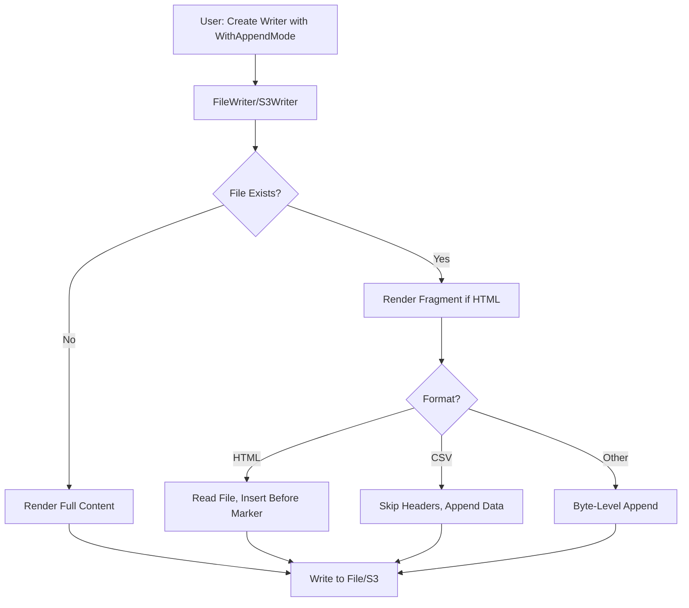

# Add-to-File Feature Design

## Overview

This document defines the design for the add-to-file feature in v2, which enables appending rendered output to existing files instead of replacing them. The feature supports both FileWriter and S3Writer with format-specific handling for HTML, CSV, and other output formats.

### Goals
- Enable incremental document building by appending to existing files
- Support NDJSON-style logging use cases
- Provide format-appropriate append behavior (fragments for HTML, headers for CSV)
- Maintain thread-safety and data integrity

### Non-Goals
- Cross-process file locking (single-process thread-safety only)
- Automatic data merging/deduplication
- Support for binary formats or compressed files

## Architecture

### High-Level Flow



### Component Interaction

The feature extends the existing Writer architecture without breaking changes:

1. **Builders** create Documents (no changes)
2. **Renderers** convert Documents to bytes (HTML renderer gains fragment mode)
3. **Writers** output bytes to destinations (FileWriter and S3Writer gain append mode)

## Components and Interfaces

### 1. FileWriter Append Mode

**Location:** `v2/file_writer.go`

#### New Fields
```go
type FileWriter struct {
    baseWriter
    dir           string
    pattern       string
    extensions    map[string]string
    allowAbsolute bool
    mu            sync.Mutex
    appendMode    bool              // NEW: Enable append mode
    permissions   os.FileMode       // NEW: Configurable file permissions (default 0644)
}
```

#### New Functional Options
```go
// WithAppendMode enables append mode for the FileWriter
func WithAppendMode() FileWriterOption {
    return func(fw *FileWriter) {
        fw.appendMode = true
    }
}

// WithPermissions sets custom file permissions (default 0644)
func WithPermissions(perm os.FileMode) FileWriterOption {
    return func(fw *FileWriter) {
        fw.permissions = perm
    }
}

// WithDisallowUnsafeAppend prevents appending to JSON/YAML files
// Returns error if user attempts to append to these formats
func WithDisallowUnsafeAppend() FileWriterOption {
    return func(fw *FileWriter) {
        fw.disallowUnsafeAppend = true
    }
}
```

#### Modified Write Method Logic

```go
func (fw *FileWriter) Write(ctx context.Context, format string, data []byte) error {
    // Existing validation...

    // Generate filename
    filename, err := fw.generateFilename(format)
    if err != nil {
        return fw.wrapError(format, err)
    }

    fullPath := filepath.Join(fw.dir, filename)

    // Check if file exists
    fileExists := fw.fileExists(fullPath)

    // Handle append mode
    if fw.appendMode && fileExists {
        return fw.appendToFile(ctx, format, fullPath, data)
    }

    // Normal write (create/truncate)
    return fw.writeNewFile(ctx, format, fullPath, data)
}
```

### 2. HTML Fragment Rendering

**Location:** `v2/renderer.go` (existing htmlRenderer)

#### Enhanced HTML Renderer

The HTML renderer already supports two modes via existing constants:
- `HTML` - Full HTML page with template
- `HTMLFragment` - HTML fragments without page structure

#### Comment Marker System

```go
const HTMLAppendMarker = "<!-- go-output-append -->"

// In htmlRenderer.Render()
func (hr *htmlRenderer) Render(ctx context.Context, doc *Document) ([]byte, error) {
    // ... existing rendering logic ...

    if hr.useTemplate {
        // Full HTML page mode - add marker before </body>
        result = insertMarkerBeforeClosingBody(result)
    }
    // Fragment mode - no marker needed

    return result, nil
}
```

#### FileWriter HTML Append Logic

```go
func (fw *FileWriter) appendToFile(ctx context.Context, format string, fullPath string, data []byte) error {
    switch format {
    case FormatHTML:
        return fw.appendHTMLWithMarker(ctx, fullPath, data)
    case FormatCSV:
        return fw.appendCSVWithoutHeaders(ctx, fullPath, data)
    default:
        return fw.appendByteLevel(ctx, fullPath, data)
    }
}

func (fw *FileWriter) appendHTMLWithMarker(ctx context.Context, fullPath string, data []byte) error {
    // Read existing file
    existing, err := os.ReadFile(fullPath)
    if err != nil {
        return fw.wrapError(FormatHTML, fmt.Errorf("failed to read existing file: %w", err))
    }

    // Find marker
    markerIndex := bytes.Index(existing, []byte(HTMLAppendMarker))
    if markerIndex == -1 {
        return fw.wrapError(FormatHTML, fmt.Errorf("HTML append marker not found in file: %s", fullPath))
    }

    // Create temp file in same directory (ensures same filesystem for atomic rename)
    // Use cryptographically secure random suffix to prevent TOCTOU attacks
    tempFile, err := os.CreateTemp(filepath.Dir(fullPath), ".go-output-*.tmp")
    if err != nil {
        return fw.wrapError(FormatHTML, fmt.Errorf("failed to create temp file: %w", err))
    }
    tempPath := tempFile.Name()
    defer os.Remove(tempPath) // Cleanup on error

    // Build new content: [existing before marker] + [new data] + [marker] + [remainder]
    var buf bytes.Buffer
    buf.Write(existing[:markerIndex])
    buf.Write(data)
    buf.WriteString(HTMLAppendMarker)
    buf.Write(existing[markerIndex+len(HTMLAppendMarker):])

    // Write to temp file
    if _, err := tempFile.Write(buf.Bytes()); err != nil {
        tempFile.Close()
        return fw.wrapError(FormatHTML, fmt.Errorf("failed to write temp file: %w", err))
    }

    // Ensure data is flushed to disk before rename (durability)
    if err := tempFile.Sync(); err != nil {
        tempFile.Close()
        return fw.wrapError(FormatHTML, fmt.Errorf("failed to sync temp file: %w", err))
    }
    tempFile.Close()

    // Atomic rename (only atomic on same filesystem)
    if err := os.Rename(tempPath, fullPath); err != nil {
        return fw.wrapError(FormatHTML, fmt.Errorf("failed to rename temp file: %w", err))
    }

    return nil
}
```

### 3. CSV Header Skipping

**Location:** `v2/file_writer.go`

FileWriter strips the first line (header) from CSV data when appending to existing files. This implementation normalizes line endings to handle both Unix (LF) and Windows (CRLF) formats:

```go
func (fw *FileWriter) appendCSVWithoutHeaders(ctx context.Context, fullPath string, data []byte) error {
    // Normalize line endings (handle both LF and CRLF)
    // This ensures consistent behavior across platforms
    data = bytes.ReplaceAll(data, []byte("\r\n"), []byte("\n"))

    // Strip first line (header) from data
    lines := bytes.SplitN(data, []byte("\n"), 2)
    if len(lines) < 2 {
        // Only one line (or empty) - nothing to append after removing header
        return nil
    }

    dataWithoutHeader := lines[1]
    return fw.appendByteLevel(ctx, fullPath, dataWithoutHeader)
}
```

**Implementation Notes:**
- Uses simple byte-level line splitting instead of CSV parsing for performance
- Normalizes `\r\n` to `\n` before splitting to handle Windows-generated CSV files
- Returns early if data contains only a header line (no data rows)
- Relies on the CSV renderer always outputting headers as the first line

### 4. S3Writer Append Mode

**Location:** `v2/s3_writer.go`

#### New Interfaces for S3 Operations

```go
// S3GetObjectAPI defines the minimal interface for S3 GetObject operations
type S3GetObjectAPI interface {
    GetObject(ctx context.Context, params *s3.GetObjectInput, optFns ...func(*s3.Options)) (*s3.GetObjectOutput, error)
}

// S3ClientAPI combines Get and Put operations for append mode
type S3ClientAPI interface {
    S3PutObjectAPI
    S3GetObjectAPI
}
```

#### Enhanced S3Writer

```go
type S3Writer struct {
    baseWriter
    client            S3ClientAPI       // Changed from S3PutObjectAPI
    bucket            string
    keyPattern        string
    contentTypes      map[string]string
    appendMode        bool              // NEW
    maxAppendSize     int64             // NEW: Default 100MB
    disallowUnsafeAppend bool          // NEW
}

// NewS3Writer signature remains the same for backward compatibility
// Internally checks if client implements S3ClientAPI for append mode support

func WithS3AppendMode() S3WriterOption {
    return func(sw *S3Writer) {
        sw.appendMode = true
    }
}

func WithMaxAppendSize(maxSize int64) S3WriterOption {
    return func(sw *S3Writer) {
        sw.maxAppendSize = maxSize
    }
}
```

#### S3 Append Logic

```go
func (sw *S3Writer) Write(ctx context.Context, format string, data []byte) error {
    // ... existing validation ...

    key, err := sw.generateKey(format)
    if err != nil {
        return sw.wrapError(format, err)
    }

    if sw.appendMode {
        return sw.appendToS3Object(ctx, format, key, data)
    }

    // Normal write (existing code)
    return sw.putS3Object(ctx, format, key, data)
}

func (sw *S3Writer) appendToS3Object(ctx context.Context, format, key string, newData []byte) error {
    // Attempt to get existing object
    // Using GetObject alone (no HeadObject) reduces API calls from 2 to 1
    getInput := &s3.GetObjectInput{
        Bucket: &sw.bucket,
        Key:    &key,
    }

    getOutput, err := sw.client.GetObject(ctx, getInput)
    if err != nil {
        // Check if object doesn't exist (NoSuchKey error)
        var nsk *types.NoSuchKey
        if errors.As(err, &nsk) {
            // Object doesn't exist - create new
            return sw.putS3Object(ctx, format, key, newData)
        }
        return sw.wrapError(format, fmt.Errorf("failed to download object for append: %w", err))
    }
    defer getOutput.Body.Close()

    // Validate size limit using ContentLength from GetObject response
    if getOutput.ContentLength != nil && *getOutput.ContentLength > sw.maxAppendSize {
        return sw.wrapError(format, fmt.Errorf("object size %d exceeds maximum append size %d",
            *getOutput.ContentLength, sw.maxAppendSize))
    }

    // Read existing content
    existingData, err := io.ReadAll(getOutput.Body)
    if err != nil {
        return sw.wrapError(format, fmt.Errorf("failed to read object content: %w", err))
    }

    // Combine data based on format
    combinedData, err := sw.combineData(format, existingData, newData)
    if err != nil {
        return err
    }

    // Upload with conditional put (ETag check for optimistic locking)
    putInput := &s3.PutObjectInput{
        Bucket:      &sw.bucket,
        Key:         &key,
        Body:        bytes.NewReader(combinedData),
        ContentType: aws.String(sw.getContentType(format)),
        IfMatch:     getOutput.ETag,  // Fail if ETag changed (detects concurrent modification)
    }

    _, err = sw.client.PutObject(ctx, putInput)
    if err != nil {
        // Check for precondition failed (ETag mismatch)
        var precondErr *types.PreconditionFailed
        if errors.As(err, &precondErr) {
            return sw.wrapError(format, fmt.Errorf("concurrent modification detected - retry the operation"))
        }
        return sw.wrapError(format, fmt.Errorf("failed to upload combined object: %w", err))
    }

    return nil
}

func (sw *S3Writer) combineData(format string, existing, new []byte) ([]byte, error) {
    switch format {
    case FormatHTML:
        return sw.combineHTMLData(existing, new)
    case FormatCSV:
        return sw.combineCSVData(existing, new)
    default:
        // Byte-level append
        return append(existing, new...), nil
    }
}
```

## Data Models

### Configuration Options

```go
// FileWriterOption configures a FileWriter
type FileWriterOption func(*FileWriter)

// S3WriterOption configures an S3Writer
type S3WriterOption func(*S3Writer)
```

### Error Types

All errors use the existing `WriteError` struct with enhanced context:

```go
type WriteError struct {
    Writer string  // "file" or "s3"
    Format string
    Cause  error
}
```

New error scenarios:
- **HTML Marker Not Found**: `WriteError{Writer: "file", Format: "html", Cause: errors.New("HTML append marker not found")}`
- **S3 Size Limit Exceeded**: `WriteError{Writer: "s3", Format: "json", Cause: errors.New("object size exceeds maximum")}`
- **S3 ETag Mismatch**: `WriteError{Writer: "s3", Format: "json", Cause: errors.New("concurrent modification detected")}`

## Error Handling

### File-Level Errors

1. **Permission Denied**: Return error with file path and operation
2. **Disk Full**: Return error during write operation
3. **HTML Marker Missing**: Return descriptive error with file path
4. **Format Mismatch**: Return error with expected vs actual extensions

### S3-Level Errors

1. **Object Size Exceeded**: Return error with current size and limit
2. **Concurrent Modification (ETag Mismatch)**: Return error suggesting retry
3. **Network Errors**: Wrapped and returned with context
4. **Invalid Credentials**: AWS SDK error bubbled up

### Atomic Operations

- **FileWriter HTML**: Write-to-temp-and-rename pattern ensures atomicity
- **S3Writer**: No atomicity guarantee (download-modify-upload not atomic), but ETag check detects conflicts

## Testing Strategy

### Unit Tests

#### FileWriter Append Mode
```go
func TestFileWriter_AppendMode(t *testing.T) {
    tests := map[string]struct {
        format       string
        initialData  string
        appendData   string
        wantCombined string
    }{
        "JSON append creates NDJSON": {
            format:       FormatJSON,
            initialData:  `{"a":1}`,
            appendData:   `{"b":2}`,
            wantCombined: `{"a":1}{"b":2}`,
        },
        "CSV append skips headers": {
            format:       FormatCSV,
            initialData:  "Name,Age\nAlice,30\n",
            appendData:   "Name,Age\nBob,25\n",
            wantCombined: "Name,Age\nAlice,30\nBob,25\n",
        },
    }

    for name, tc := range tests {
        t.Run(name, func(t *testing.T) {
            // Test implementation...
        })
    }
}
```

#### HTML Fragment Rendering
```go
func TestHTMLRenderer_FragmentMode(t *testing.T) {
    tests := map[string]struct {
        useTemplate bool
        wantMarker  bool
    }{
        "Full HTML has marker": {
            useTemplate: true,
            wantMarker:  true,
        },
        "Fragment has no marker": {
            useTemplate: false,
            wantMarker:  false,
        },
    }

    for name, tc := range tests {
        t.Run(name, func(t *testing.T) {
            // Test implementation...
        })
    }
}
```

#### Atomic HTML Updates
```go
func TestFileWriter_HTMLAtomicUpdate(t *testing.T) {
    // Test that partial writes don't corrupt original file
    // Verify temp files are created in same directory (same filesystem)
    // Verify temp files use cryptographically random suffixes (no TOCTOU)
    // Verify Sync() is called before rename (durability)
    // Simulate failure after temp file write but before rename
    // Verify original file remains unchanged on error
    // Verify temp file is cleaned up on error
}
```

#### CSV Cross-Platform Line Endings
```go
func TestFileWriter_CSVAppendCRLF(t *testing.T) {
    tests := map[string]struct {
        initialData  string
        appendData   string
        wantCombined string
    }{
        "Unix LF line endings": {
            initialData:  "Name,Age\nAlice,30\n",
            appendData:   "Name,Age\nBob,25\n",
            wantCombined: "Name,Age\nAlice,30\nBob,25\n",
        },
        "Windows CRLF line endings": {
            initialData:  "Name,Age\r\nAlice,30\r\n",
            appendData:   "Name,Age\r\nBob,25\r\n",
            wantCombined: "Name,Age\r\nAlice,30\nBob,25\n",
        },
        "Mixed line endings": {
            initialData:  "Name,Age\r\nAlice,30\n",
            appendData:   "Name,Age\nBob,25\r\n",
            wantCombined: "Name,Age\r\nAlice,30\nBob,25\n",
        },
    }

    for name, tc := range tests {
        t.Run(name, func(t *testing.T) {
            // Test that CRLF normalization works correctly
        })
    }
}
```

### Integration Tests

#### FileWriter End-to-End
```go
func TestFileWriter_AppendModeIntegration(t *testing.T) {
    if os.Getenv("INTEGRATION") == "" {
        t.Skip("Skipping integration test")
    }

    // Create FileWriter with append mode
    // Write initial document
    // Append second document
    // Verify combined output
}
```

#### S3Writer Append Mode
```go
func TestS3Writer_AppendModeIntegration(t *testing.T) {
    if os.Getenv("INTEGRATION") == "" {
        t.Skip("Skipping integration test")
    }

    // Requires mock S3 or localstack
    // Test download-modify-upload flow
    // Test ETag conflict detection
    // Test size validation
}
```

### Thread Safety Tests

```go
func TestFileWriter_ConcurrentAppends(t *testing.T) {
    // Launch multiple goroutines appending with same FileWriter
    // Verify no data corruption
    // Verify all appends complete successfully
}
```

### Cross-Platform Tests

```go
// Tests should run on Linux, macOS, and Windows
// Focus on file permission handling differences
// Test path separator handling
```

## Implementation Phases

### Phase 1: FileWriter Append Mode (Core)
- Add `appendMode` field and `WithAppendMode()` option
- Implement `appendByteLevel()` for simple formats
- Add format validation
- Thread safety with `sync.Mutex`
- Unit tests for all formats

### Phase 2: HTML Fragment Mode
- Implement HTML marker insertion in renderer
- Implement `appendHTMLWithMarker()` with atomic writes
- Test marker detection and insertion
- Test temp-file-and-rename atomicity

### Phase 3: CSV Header Handling
- Implement `appendCSVWithoutHeaders()`
- Test header stripping logic
- Test edge cases (empty files, single-line files)

### Phase 4: S3Writer Append Mode
- Add S3 GetObject interface
- Implement `appendToS3Object()` with ETag checks
- Implement size validation
- Add `WithMaxAppendSize()` option
- Integration tests with mock S3

### Phase 5: Error Handling & Polish
- Comprehensive error messages
- Documentation and examples
- Migration guide for v1 users
- Performance benchmarks

## Security Considerations

1. **File Path Validation**: Existing FileWriter validation prevents directory traversal
2. **Permissions**: Default 0644 prevents execution, configurable via `WithPermissions()`
3. **TOCTOU Protection**: `os.CreateTemp()` uses cryptographically random suffixes to prevent Time-of-Check-Time-of-Use attacks on temp files
4. **Atomic Writes**: Write-to-temp-and-rename pattern ensures atomic updates (prevents partial writes on crash)
5. **Same-Filesystem Requirement**: Temp files created in same directory as target to ensure `os.Rename()` atomicity
6. **S3 Credentials**: User-provided S3 client (library doesn't manage credentials)
7. **Temp File Cleanup**: `defer os.Remove()` ensures temp files are removed on errors
8. **UTF-8 Encoding**: All files assumed UTF-8 (documented limitation)

## Performance Considerations

1. **HTML Append**: Reading entire file into memory - acceptable for typical HTML reports (<10MB)
2. **S3 Append**: Download entire object - mitigated by `maxAppendSize` limit (default 100MB)
3. **Mutex Overhead**: Minimal - only locks during file operations
4. **CSV Header Parsing**: Simple line split, negligible overhead

## Open Questions

None at this time. All decisions documented in decision_log.md.
