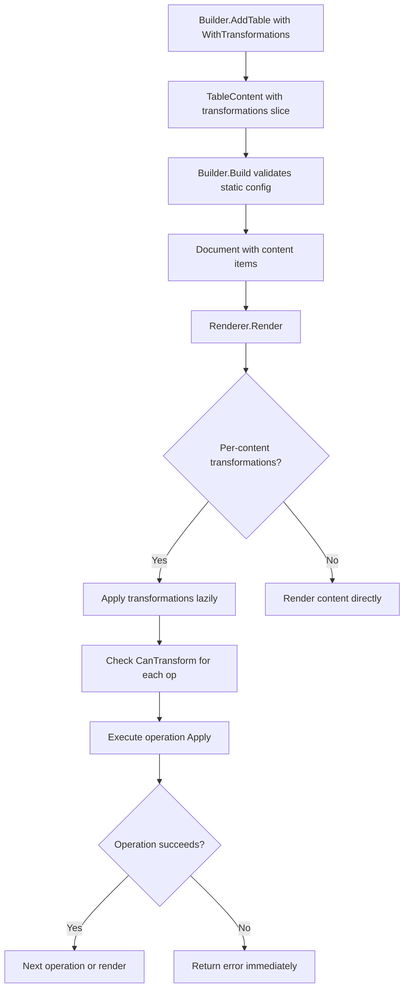
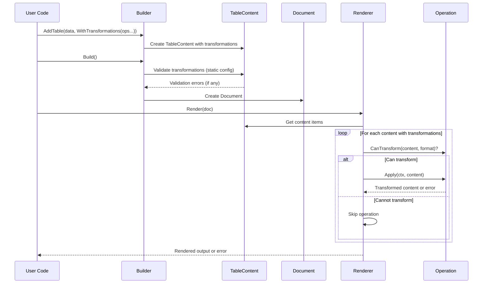

# Per-Content Transformations Design

## Overview

This document provides the detailed design for per-content transformations in go-output v2. The feature enables developers to attach transformation operations (filtering, sorting, limiting, etc.) directly to individual content items at creation time, rather than applying transformations globally through a document-level pipeline.

### Key Design Principles

1. **Content-Centric**: Transformations belong to content items, not documents
2. **Lazy Execution**: Transformations execute during rendering, preserving original data
3. **Thread-Safe**: Operations must be stateless and safe for concurrent rendering
4. **Fail-Fast**: Always fail immediately on transformation errors
5. **Migration Path**: Deprecate document-level Pipeline API with clear migration examples

## Architecture

### High-Level Flow



### Component Interactions



## Components and Interfaces

### 1. Enhanced Content Interface

The existing Content interface is extended to include transformation capabilities:

```go
// Content interface - enhanced with transformation support
type Content interface {
    ID() string
    Title() string
    Type() ContentType
    Clone() Content
    GetTransformations() []Operation
    encoding.TextAppender
    encoding.BinaryAppender
}
```

All content types (TableContent, TextContent, RawContent, SectionContent) implement these methods, making every content item transformable.

### 2. Content Structure Enhancement

All content types will be enhanced to store transformations:

```go
// TableContent with transformations
type TableContent struct {
    id              string
    title           string
    schema          *Schema
    records         []Record
    transformations []Operation  // NEW: Per-content transformations
}

// Implement Content interface method
func (tc *TableContent) GetTransformations() []Operation {
    return tc.transformations
}

// Similarly for TextContent, RawContent, SectionContent
type TextContent struct {
    id              string
    text            string
    style           TextStyle
    transformations []Operation  // NEW
}

func (tc *TextContent) GetTransformations() []Operation {
    return tc.transformations
}

type RawContent struct {
    id              string
    format          string
    data            []byte
    transformations []Operation  // NEW
}

func (rc *RawContent) GetTransformations() []Operation {
    return rc.transformations
}

type SectionContent struct {
    id              string
    title           string
    level           int
    contents        []Content
    transformations []Operation  // NEW
}

func (sc *SectionContent) GetTransformations() []Operation {
    return sc.transformations
}
```

### 3. Functional Options

New `WithTransformations()` option for all content types:

```go
// TableOption - add to existing options
func WithTransformations(ops ...Operation) TableOption {
    return func(tc *tableConfig) {
        tc.transformations = ops
    }
}

// TextOption - new for text content
func WithTransformations(ops ...Operation) TextOption {
    return func(config *textConfig) {
        config.transformations = ops
    }
}

// RawOption - new for raw content
func WithTransformations(ops ...Operation) RawOption {
    return func(config *rawConfig) {
        config.transformations = ops
    }
}

// SectionOption - new for section content
func WithTransformations(ops ...Operation) SectionOption {
    return func(config *sectionConfig) {
        config.transformations = ops
    }
}
```

### 4. Rendering-Time Validation

Validation occurs during rendering when transformations are applied, allowing for both configuration and data-dependent validation in a single phase.

### 5. Transformation Execution During Rendering

Add transformation execution logic in renderers:

```go
// Helper function for applying per-content transformations
func applyContentTransformations(ctx context.Context, content Content) (Content, error) {
    transformations := content.GetTransformations()
    if len(transformations) == 0 {
        return content, nil // No transformations
    }

    // Start with a clone to preserve immutability
    current := content.Clone()

    // Apply each transformation in sequence
    for i, op := range transformations {
        // Check context cancellation before operation
        if err := ctx.Err(); err != nil {
            return nil, fmt.Errorf("content %s transformation cancelled: %w",
                content.ID(), err)
        }

        // Validate operation configuration
        if err := op.Validate(); err != nil {
            return nil, fmt.Errorf("content %s transformation %d (%s) invalid: %w",
                content.ID(), i, op.Name(), err)
        }

        // Apply the operation
        // NOTE: Operations should NOT check context in hot loops (e.g., sort comparators)
        // Context checking happens here between operations, providing responsive cancellation
        // without performance degradation in CPU-bound operations
        result, err := op.Apply(ctx, current)
        if err != nil {
            return nil, fmt.Errorf("content %s transformation %d (%s) failed: %w",
                content.ID(), i, op.Name(), err)
        }
        current = result
    }

    return current, nil
}
```

### 6. Cloning Behavior

Content cloning already exists in v2. The Clone() method is added to the Content interface to formalize this capability.

Update `Clone()` methods to preserve transformations:

```go
// TableContent.Clone() - enhanced
func (tc *TableContent) Clone() Content {
    // Deep copy records
    newRecords := make([]Record, len(tc.records))
    for i, record := range tc.records {
        newRecord := make(Record)
        maps.Copy(newRecord, record)
        newRecords[i] = newRecord
    }

    // Deep copy schema
    var newSchema *Schema
    if tc.schema != nil {
        newFields := make([]Field, len(tc.schema.Fields))
        copy(newFields, tc.schema.Fields)

        newKeyOrder := make([]string, len(tc.schema.keyOrder))
        copy(newKeyOrder, tc.schema.keyOrder)

        newSchema = &Schema{
            Fields:   newFields,
            keyOrder: newKeyOrder,
        }
    }

    // Shallow copy transformations (share same operation instances)
    var newTransformations []Operation
    if len(tc.transformations) > 0 {
        newTransformations = make([]Operation, len(tc.transformations))
        copy(newTransformations, tc.transformations)
    }

    return &TableContent{
        id:              tc.id,
        title:           tc.title,
        records:         newRecords,
        schema:          newSchema,
        transformations: newTransformations,  // NEW
    }
}
```

## Data Models

### Transformation Configuration

```go
// Content options configuration
type tableConfig struct {
    keys            []string
    schema          *Schema
    autoSchema      bool
    transformations []Operation  // NEW
}

type textConfig struct {
    style           TextStyle
    transformations []Operation  // NEW
}

type rawConfig struct {
    validateFormat  bool
    transformations []Operation  // NEW
}

type sectionConfig struct {
    level           int
    transformations []Operation  // NEW
}
```

### Rendering Behavior

Rendering always uses fail-fast mode - stopping immediately on the first transformation error. This provides predictable, safe behavior without additional configuration complexity.

## Error Handling

### Transformation Errors

All errors occur during rendering with clear context about what failed:

```go
// Fail-fast rendering (only mode)
func render(ctx context.Context, doc *Document) ([]byte, error) {
    for _, content := range doc.GetContents() {
        transformed, err := applyContentTransformations(ctx, content)
        if err != nil {
            // Error includes content ID and operation index
            return nil, err
        }
        // ... render transformed content ...
    }
    return result, nil
}

// Error messages provide clear context
// Example: "content users transformation 2 (sort) failed: column 'age' not found"
```

## Testing Strategy

### Unit Tests

1. **Transformation Storage and Retrieval**
   - Test `WithTransformations()` option correctly stores operations
   - Test transformations preserved during cloning
   - Test transformations accessible from content

2. **Transformation Execution**
   - Test lazy execution during rendering
   - Test operations execute in order
   - Test context cancellation
   - Test fail-fast error handling
   - Test validation during rendering

3. **Thread Safety**
   - Test concurrent rendering with same operations
   - Test `ValidateStatelessOperation()` utility
   - Use `-race` detector in tests

4. **Error Handling**
   - Test error messages include content ID and operation index
   - Test error propagation during rendering

### Integration Tests

1. **End-to-End Workflows**
   - Build document with transformed tables → Render to JSON/YAML
   - Multiple tables with different transformations
   - Mixed content (tables with/without transformations)

2. **Migration Scenarios**
   - Convert pipeline-based code to per-content transformations
   - Side-by-side comparison of outputs

3. **Performance Tests**
   - 100 content items with 10 transformations each
   - Memory profiling for transformation overhead
   - Benchmark transformation execution time

### Example Test

```go
func TestPerContentTransformations(t *testing.T) {
    tests := map[string]struct {
        data           []Record
        transformations []Operation
        expected       []Record
        wantErr        bool
    }{
        "filter and sort": {
            data: []Record{
                {"name": "Alice", "age": 30},
                {"name": "Bob", "age": 25},
                {"name": "Charlie", "age": 35},
            },
            transformations: []Operation{
                NewFilterOp(func(r Record) bool {
                    return r["age"].(int) >= 30
                }),
                NewSortOp(SortKey{Column: "name", Direction: Ascending}),
            },
            expected: []Record{
                {"name": "Alice", "age": 30},
                {"name": "Charlie", "age": 35},
            },
        },
    }

    for name, tc := range tests {
        t.Run(name, func(t *testing.T) {
            builder := NewBuilder()
            builder.AddTable("test", tc.data,
                WithKeys("name", "age"),
                WithTransformations(tc.transformations...),
            )

            doc := builder.Build()

            renderer := NewJSONRenderer()
            result, err := renderer.Render(context.Background(), doc)

            if tc.wantErr && err == nil {
                t.Error("Expected error but got none")
            }
            if !tc.wantErr && err != nil {
                t.Errorf("Unexpected error: %v", err)
            }

            // Verify transformed content
            // ... assertions ...
        })
    }
}
```

## Migration Guide

### From Pipeline API to Per-Content Transformations

**Before (Pipeline API - deprecated):**
```go
builder := output.NewBuilder()
builder.AddTable("users", users, output.WithKeys("name", "email", "age"))
builder.AddTable("products", products, output.WithKeys("id", "name", "price"))

doc := builder.Build()

// Apply global transformations
transformed, err := doc.Pipeline().
    Filter(func(r output.Record) bool {
        return r["age"].(int) >= 18
    }).
    Sort(output.SortKey{Column: "name", Direction: output.Ascending}).
    Execute()
```

**After (Per-Content Transformations):**
```go
builder := output.NewBuilder()

// Each table gets its own transformations
builder.AddTable("users", users,
    output.WithKeys("name", "email", "age"),
    output.WithTransformations(
        output.NewFilterOp(func(r output.Record) bool {
            return r["age"].(int) >= 18
        }),
        output.NewSortOp(output.SortKey{Column: "name", Direction: output.Ascending}),
    ),
)

builder.AddTable("products", products,
    output.WithKeys("id", "name", "price"),
    output.WithTransformations(
        output.NewSortOp(output.SortKey{Column: "price", Direction: output.Descending}),
        output.NewLimitOp(10),  // Top 10 by price
    ),
)

doc := builder.Build()
// Transformations applied during rendering
```

### Dynamic Transformation Construction

**Before:**
```go
pipeline := doc.Pipeline()
if userWantsFiltering {
    pipeline = pipeline.Filter(predicate)
}
if userWantsSorting {
    pipeline = pipeline.Sort(keys)
}
transformed, err := pipeline.Execute()
```

**After:**
```go
var transformations []output.Operation

if userWantsFiltering {
    transformations = append(transformations, output.NewFilterOp(predicate))
}
if userWantsSorting {
    transformations = append(transformations, output.NewSortOp(keys...))
}

builder.AddTable("data", data,
    output.WithKeys(...),
    output.WithTransformations(transformations...),
)
```

## Performance Characteristics

### Memory Overhead

- **Per-content transformations**: O(1) per content item (slice of operation references)
- **Cloning during Apply()**: O(n) where n = number of records × number of operations in chain
- **Example**: 100 tables × 10 operations × 1000 records = ~1000 clones during rendering

### Time Complexity

- **Build() validation**: O(c × t) where c = content items, t = transformations per content
- **Rendering**: O(c × t × r) where r = records per table
- **Target**: 100 content items × 10 transformations × 1000 records = ~1M operations (< 1s on modern hardware)

### Optimization Opportunities

1. **Operation fusion**: Combine multiple compatible operations (e.g., two filters → one filter)
2. **Lazy cloning**: Clone only when mutation occurs
3. **Caching**: Cache transformed content for multiple renders (future enhancement)

## Design Rationale

Key design decisions and their rationale are documented in `decision_log.md`. Major decisions include:

- **Content Interface Extension** (Decision 6): All content types implement transformations directly
- **Single Validation Phase** (Decision 8): Validation occurs during rendering only
- **Fail-Fast Error Handling** (Decision 9): No partial rendering mode
- **Context Propagation** (Decision 14): Check context once before each operation
- **Stateless Operations** (Decision 13): Testing utility for validation

See `decision_log.md` for complete decision history and rationale.
