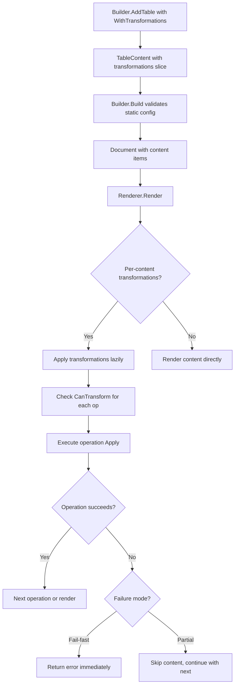
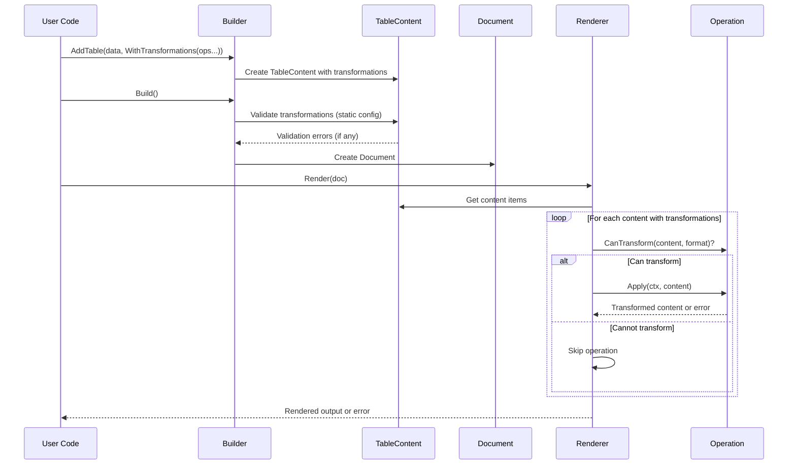

# Per-Content Transformations Design

## Overview

This document provides the detailed design for per-content transformations in go-output v2. The feature enables developers to attach transformation operations (filtering, sorting, limiting, etc.) directly to individual content items at creation time, rather than applying transformations globally through a document-level pipeline.

### Key Design Principles

1. **Content-Centric**: Transformations belong to content items, not documents
2. **Lazy Execution**: Transformations execute during rendering, preserving original data
3. **Thread-Safe**: Operations must be stateless and safe for concurrent rendering
4. **Fail-Safe**: Default to fail-fast with optional partial rendering mode
5. **Migration Path**: Deprecate document-level Pipeline API with clear migration examples

## Architecture

### High-Level Flow



### Component Interactions



## Components and Interfaces

### 1. TransformableContent Interface

A new interface that extends Content with transformation capabilities:

```go
// TransformableContent represents content that can have transformations applied
type TransformableContent interface {
    Content

    // Clone creates a deep copy of the content for transformation
    Clone() Content

    // GetTransformations returns the transformations attached to this content
    GetTransformations() []Operation
}
```

### 2. Content Structure Enhancement

All content types will be enhanced to store transformations and implement TransformableContent:

```go
// TableContent with transformations
type TableContent struct {
    id              string
    title           string
    schema          *Schema
    records         []Record
    transformations []Operation  // NEW: Per-content transformations
}

// Implement TransformableContent
func (tc *TableContent) GetTransformations() []Operation {
    return tc.transformations
}

// Similarly for TextContent, RawContent, SectionContent
type TextContent struct {
    id              string
    text            string
    style           TextStyle
    transformations []Operation  // NEW
}

func (tc *TextContent) GetTransformations() []Operation {
    return tc.transformations
}

type RawContent struct {
    id              string
    format          string
    data            []byte
    transformations []Operation  // NEW
}

func (rc *RawContent) GetTransformations() []Operation {
    return rc.transformations
}

type SectionContent struct {
    id              string
    title           string
    level           int
    contents        []Content
    transformations []Operation  // NEW
}

func (sc *SectionContent) GetTransformations() []Operation {
    return sc.transformations
}
```

### 3. Functional Options

New `WithTransformations()` option for all content types:

```go
// TableOption - add to existing options
func WithTransformations(ops ...Operation) TableOption {
    return func(tc *tableConfig) {
        tc.transformations = ops
    }
}

// TextOption - new for text content
func WithTransformations(ops ...Operation) TextOption {
    return func(config *textConfig) {
        config.transformations = ops
    }
}

// RawOption - new for raw content
func WithTransformations(ops ...Operation) RawOption {
    return func(config *rawConfig) {
        config.transformations = ops
    }
}

// SectionOption - new for section content
func WithTransformations(ops ...Operation) SectionOption {
    return func(config *sectionConfig) {
        config.transformations = ops
    }
}
```

### 4. Build-Time Validation

Enhance `Builder.Build()` to validate per-content transformations:

```go
// Builder - add validation during Build()
func (b *Builder) Build() *Document {
    b.mu.Lock()
    defer b.mu.Unlock()

    // Validate all per-content transformations (static config only)
    for _, content := range b.doc.contents {
        if transformable, ok := content.(TransformableContent); ok {
            for i, op := range transformable.GetTransformations() {
                if err := op.Validate(); err != nil {
                    // Wrap error with content context
                    validationErr := fmt.Errorf("content %s transformation %d (%s): %w",
                        content.ID(), i, op.Name(), err)
                    b.errors = append(b.errors, validationErr)
                }
            }
        }
    }

    doc := b.doc
    b.doc = nil
    return doc
}
```

### 5. Transformation Execution During Rendering

Add transformation execution logic in renderers:

```go
// Helper function for applying per-content transformations
func applyContentTransformations(ctx context.Context, content Content, format string) (Content, error) {
    // Check if content has transformations
    transformable, ok := content.(TransformableContent)
    if !ok {
        return content, nil // No transformations
    }

    transformations := transformable.GetTransformations()
    if len(transformations) == 0 {
        return content, nil // No transformations
    }

    // Start with a clone to preserve immutability
    current := transformable.Clone()

    // Apply each transformation in sequence
    for i, op := range transformations {
        // Check context cancellation BEFORE each operation (not during)
        select {
        case <-ctx.Done():
            return nil, fmt.Errorf("content %s transformation cancelled: %w",
                content.ID(), ctx.Err())
        default:
        }

        // Check if operation applies to this content type and format
        if formatAwareOp, ok := op.(FormatAwareOperation); ok {
            if !formatAwareOp.CanTransform(current, format) {
                continue // Skip non-applicable operation
            }
        }

        // Apply the operation
        // NOTE: Operations should NOT check context in hot loops (e.g., sort comparators)
        // Context checking happens here between operations, providing responsive cancellation
        // without performance degradation in CPU-bound operations
        var err error
        if formatAwareOp, ok := op.(FormatAwareOperation); ok {
            current, err = formatAwareOp.ApplyWithFormat(ctx, current, format)
        } else {
            current, err = op.Apply(ctx, current)
        }

        if err != nil {
            return nil, fmt.Errorf("content %s transformation %d (%s) failed: %w",
                content.ID(), i, op.Name(), err)
        }
    }

    return current, nil
}
```

### 6. Cloning Behavior

Update `Clone()` methods to preserve transformations:

```go
// TableContent.Clone() - enhanced
func (tc *TableContent) Clone() Content {
    // Deep copy records
    newRecords := make([]Record, len(tc.records))
    for i, record := range tc.records {
        newRecord := make(Record)
        maps.Copy(newRecord, record)
        newRecords[i] = newRecord
    }

    // Deep copy schema
    var newSchema *Schema
    if tc.schema != nil {
        newFields := make([]Field, len(tc.schema.Fields))
        copy(newFields, tc.schema.Fields)

        newKeyOrder := make([]string, len(tc.schema.keyOrder))
        copy(newKeyOrder, tc.schema.keyOrder)

        newSchema = &Schema{
            Fields:   newFields,
            keyOrder: newKeyOrder,
        }
    }

    // Shallow copy transformations (share same operation instances)
    var newTransformations []Operation
    if len(tc.transformations) > 0 {
        newTransformations = make([]Operation, len(tc.transformations))
        copy(newTransformations, tc.transformations)
    }

    return &TableContent{
        id:              tc.id,
        title:           tc.title,
        records:         newRecords,
        schema:          newSchema,
        transformations: newTransformations,  // NEW
    }
}
```

## Data Models

### Transformation Configuration

```go
// Content options configuration
type tableConfig struct {
    keys            []string
    schema          *Schema
    autoSchema      bool
    transformations []Operation  // NEW
}

type textConfig struct {
    style           TextStyle
    transformations []Operation  // NEW
}

type rawConfig struct {
    validateFormat  bool
    transformations []Operation  // NEW
}

type sectionConfig struct {
    level           int
    transformations []Operation  // NEW
}
```

### Failure Mode Configuration

```go
// RenderOptions - new structure for renderer configuration
type RenderOptions struct {
    FailureMode FailureMode
    // Other rendering options...
}

// FailureMode determines behavior when transformations fail
type FailureMode int

const (
    // FailFast stops rendering on first transformation error (default)
    FailFast FailureMode = iota
    // PartialRender skips failed content and continues with remaining content
    PartialRender
)

// Renderer configuration
type BaseRenderer struct {
    options RenderOptions
}

// Option function for configuration
func WithFailureMode(mode FailureMode) RenderOption {
    return func(r *BaseRenderer) {
        r.options.FailureMode = mode
    }
}
```

## Design Decisions and Trade-offs

### Decision 1: Closure Safety Best Practices

**Problem**: Operations with closures need clear guidelines to avoid common pitfalls.

**Note**: This project uses Go 1.24+, which has fixed the historic loop variable capture issue. However, developers should still follow closure best practices.

**Decision**: Document closure best practices without unnecessary workarounds

**Guidelines**:

1. **Prefer explicit parameters**: When possible, pass values as parameters rather than capturing them
2. **Be mindful of mutable state**: Avoid capturing pointers to mutable data
3. **Document closure behavior**: Make it clear when operations capture external state

**Example - Clear closure usage**:

```go
// Good: Clear about what's being captured
threshold := 50
builder.AddTable("data", data,
    WithTransformations(
        NewFilterOp(func(r Record) bool {
            return r["value"].(int) > threshold  // Captures threshold (clear intent)
        }),
    ),
)

// Also good: Factory helper for common patterns
func NewFilterByField(field string, predicate func(any) bool) *FilterOp {
    return &FilterOp{
        predicate: func(r Record) bool {
            return predicate(r[field])
        },
    }
}
```

**Documentation**: Include closure usage examples in godoc and best practices guide.

### Decision 2: Runtime Stateless Validation

**Problem**: Operations must be stateless for thread safety, but Go cannot enforce this at compile time.

**Research Findings**:
- No automatic runtime detection for pure functions in Go
- Best practice is manual testing with deterministic checks
- Libraries use testing utilities to verify behavior

**Decision**: Provide testing utility for detecting output non-determinism

**Implementation**:

```go
// Testing utility for validating output determinism
// NOTE: This checks if operations produce consistent results, but does NOT detect:
// - Hidden state mutations that don't affect output
// - External side effects (file writes, network calls)
// - Non-deterministic operations that happen to match twice
func ValidateStatelessOperation(t *testing.T, op Operation, testContent Content) {
    t.Helper()

    ctx := context.Background()

    // Apply operation twice
    result1, err1 := op.Apply(ctx, testContent.(TransformableContent).Clone())
    if err1 != nil {
        t.Fatalf("First application failed: %v", err1)
    }

    result2, err2 := op.Apply(ctx, testContent.(TransformableContent).Clone())
    if err2 != nil {
        t.Fatalf("Second application failed: %v", err2)
    }

    // Results should be identical
    if !reflect.DeepEqual(result1, result2) {
        t.Errorf("Operation produces non-deterministic results")
    }
}

// Example test:
func TestFilterOpIsStateless(t *testing.T) {
    op := NewFilterOp(func(r Record) bool {
        return r["value"].(int) > 50
    })

    testContent := &TableContent{
        records: []Record{
            {"value": 40},
            {"value": 60},
        },
    }

    ValidateStatelessOperation(t, op, testContent)
}
```

**Limitations**: This utility only detects observable non-determinism in output. Operations must still be designed to be stateless (no field mutations, no external side effects).

**Documentation**: Document testing utility with clear limitations and encourage its use in test suites.

### Decision 3: Partial Rendering API Configuration

**Problem**: How should partial rendering mode be configured - per-document, per-renderer, or both?

**Research Findings**:
- Go resilience libraries (failsafe-go, goresilience) use policy composition
- Circuit breaker and retry patterns are configured at the point of use
- Rendering configuration is typically per-renderer, not per-document

**Decision**: Configure failure mode at renderer level via functional options

**Implementation**:

```go
// Renderer creation with options
jsonRenderer := output.NewJSONRenderer(
    output.WithFailureMode(output.PartialRender),
    output.WithPrettyPrint(true),
)

// Or use default (FailFast)
defaultRenderer := output.NewJSONRenderer()

// Render with configured behavior
result, err := jsonRenderer.Render(doc)
if err != nil {
    // In PartialRender mode, err may contain information about skipped content
    if partialErr, ok := err.(*PartialRenderError); ok {
        log.Printf("Rendered partial document, skipped %d items", len(partialErr.Skipped))
    }
}
```

**Rationale**:
- Renderer-level configuration matches Go idioms (http.Server, sql.DB)
- Single configuration point, clear behavior per render call
- Allows different renderers with different failure modes for same document

### Decision 4: Context Propagation

**Problem**: How is context threaded through transformation chains?

**Research Findings**:
- Go blog: "pass Context explicitly as first parameter"
- Pipeline cancellation: check `<-ctx.Done()` between stages
- Child contexts for per-stage timeouts if needed

**Decision**: Pass context through operation chain, check before each operation

**Implementation**:

```go
// Context passed from renderer to transformation chain
func (r *JSONRenderer) Render(ctx context.Context, doc *Document) ([]byte, error) {
    // Apply timeout if configured
    if r.options.Timeout > 0 {
        var cancel context.CancelFunc
        ctx, cancel = context.WithTimeout(ctx, r.options.Timeout)
        defer cancel()
    }

    for _, content := range doc.GetContents() {
        // Apply per-content transformations with context
        transformed, err := applyContentTransformations(ctx, content, "json")
        if err != nil {
            if errors.Is(err, context.Canceled) || errors.Is(err, context.DeadlineExceeded) {
                return nil, fmt.Errorf("rendering cancelled: %w", err)
            }
            return nil, err
        }

        // Render transformed content
        // ...
    }
}

// Operation checks context BEFORE executing (not during hot loops)
func (o *SortOp) Apply(ctx context.Context, content Content) (Content, error) {
    // Check cancellation before starting operation
    select {
    case <-ctx.Done():
        return nil, ctx.Err()
    default:
    }

    // Perform sorting without context checks
    // NOTE: Context checks in comparator functions create massive performance overhead
    // (10,000+ channel operations for sorting 10,000 records)
    // Instead, we check context BEFORE and AFTER the operation
    sort.SliceStable(records, func(i, j int) bool {
        return o.compareRecords(records[i], records[j]) < 0
    })

    // Check after operation completes
    select {
    case <-ctx.Done():
        return nil, ctx.Err()
    default:
    }

    return cloned, nil
}
```

**Rationale**:
- Explicit context passing follows Go conventions
- Checks before/after operations balance responsiveness with performance
- Avoids context checks in hot loops (comparators, predicates) which create severe overhead
- Works with existing timeout mechanisms

### Decision 5: Debug Hints in Error Messages

**Problem**: Should error messages include data samples to aid debugging?

**Research Findings**:
- OWASP: Never log PII (health, government IDs, financial data) in production
- Error messages often appear in logs, monitoring systems, and bug reports
- Data samples are helpful during development but risky in production
- Simple field name matching cannot reliably detect all PII

**Decision**: Opt-in debug mode with simple sensitive field redaction

**Implementation**:

```go
// Error options
type ErrorOptions struct {
    IncludeDataSamples bool
    SensitiveFields    []string  // Fields to redact
}

// Default: no data samples
var DefaultErrorOptions = ErrorOptions{
    IncludeDataSamples: false,
    SensitiveFields: []string{
        "password", "token", "secret", "key", "ssn",
        "credit_card", "account_number", "api_key",
    },
}

// Operation error with conditional data samples
func (o *FilterOp) Apply(ctx context.Context, content Content) (Content, error) {
    tableContent, ok := content.(*TableContent)
    if !ok {
        return nil, NewValidationError("content_type", content.Type().String(),
            "filter operation requires table content")
    }

    // ... filtering logic ...

    if err != nil {
        opErr := fmt.Errorf("filter operation failed: %w", err)

        // Only include data samples if explicitly enabled
        if shouldIncludeDataSamples() {
            // Redact sensitive fields
            sanitizedSample := redactSensitiveFields(tableContent.records[0])
            return nil, fmt.Errorf("%w (sample: %v)", opErr, sanitizedSample)
        }

        return nil, opErr
    }

    return cloned, nil
}

// Helper to check if data samples should be included
func shouldIncludeDataSamples() bool {
    // Check environment variable or global config
    return os.Getenv("GO_OUTPUT_DEBUG") == "true"
}

// Redact sensitive fields from record
func redactSensitiveFields(record Record) Record {
    sanitized := make(Record)
    for k, v := range record {
        if isSensitiveField(k) {
            sanitized[k] = "[REDACTED]"
        } else {
            sanitized[k] = v
        }
    }
    return sanitized
}

func isSensitiveField(fieldName string) bool {
    fieldLower := strings.ToLower(fieldName)
    for _, sensitive := range DefaultErrorOptions.SensitiveFields {
        if strings.Contains(fieldLower, sensitive) {
            return true
        }
    }
    return false
}
```

**Rationale**:
- **Primary goal**: Help developers debug transformation failures during development
- **Not a security feature**: Simple field name matching cannot reliably detect all PII
- **Production safety**: Disabled by default (GO_OUTPUT_DEBUG must be explicitly enabled)
- **Development aid**: Data samples with basic redaction help troubleshoot predicate/comparator issues
- **Limitations understood**: This is convenience tooling, not a security boundary
- **Documentation emphasis**: Developers must ensure production environments don't set GO_OUTPUT_DEBUG=true

**Important Notes**:
- Field name redaction is a courtesy, not comprehensive PII protection
- Production systems should never enable data samples regardless of redaction
- For true security, implement proper log sanitization at the infrastructure level
- This feature exists to improve the development experience, not to secure production logs

## Error Handling

### Build-Time Validation Errors

```go
// Validation errors collected in Builder
type ValidationError struct {
    ContentID   string
    OpIndex     int
    OpName      string
    Cause       error
}

func (e *ValidationError) Error() string {
    return fmt.Sprintf("content %s transformation %d (%s): %v",
        e.ContentID, e.OpIndex, e.OpName, e.Cause)
}

// Usage
doc := builder.Build()
if builder.HasErrors() {
    for _, err := range builder.Errors() {
        log.Printf("Validation error: %v", err)
    }
}
```

### Render-Time Transformation Errors

```go
// Fail-fast mode (default)
func renderFailFast(ctx context.Context, doc *Document) ([]byte, error) {
    for _, content := range doc.GetContents() {
        transformed, err := applyContentTransformations(ctx, content, format)
        if err != nil {
            return nil, err  // Stop immediately
        }
        // ... render transformed content ...
    }
    return result, nil
}

// Partial rendering mode
type PartialRenderError struct {
    Skipped []SkippedContent
}

type SkippedContent struct {
    ContentID string
    Reason    error
}

func (e *PartialRenderError) Error() string {
    return fmt.Sprintf("partial render: skipped %d content items", len(e.Skipped))
}

func renderPartial(ctx context.Context, doc *Document) ([]byte, error) {
    var skipped []SkippedContent
    var output []byte

    for _, content := range doc.GetContents() {
        transformed, err := applyContentTransformations(ctx, content, format)
        if err != nil {
            skipped = append(skipped, SkippedContent{
                ContentID: content.ID(),
                Reason:    err,
            })
            continue  // Skip this content, continue with rest
        }

        // Render transformed content
        rendered, err := renderContent(transformed)
        if err != nil {
            skipped = append(skipped, SkippedContent{
                ContentID: content.ID(),
                Reason:    err,
            })
            continue
        }

        output = append(output, rendered...)
    }

    if len(skipped) > 0 {
        return output, &PartialRenderError{Skipped: skipped}
    }

    return output, nil
}
```

## Testing Strategy

### Unit Tests

1. **Transformation Storage and Retrieval**
   - Test `WithTransformations()` option correctly stores operations
   - Test transformations preserved during cloning
   - Test transformations accessible from content

2. **Build-Time Validation**
   - Test static configuration validation (nil predicates, negative limits)
   - Test validation errors collected in Builder.Errors()
   - Test Build() completes with errors

3. **Transformation Execution**
   - Test lazy execution during rendering
   - Test CanTransform() filters non-applicable operations
   - Test operations execute in order
   - Test context cancellation
   - Test both fail-fast and partial rendering modes

4. **Thread Safety**
   - Test concurrent rendering with same operations
   - Test `ValidateStatelessOperation()` utility
   - Use `-race` detector in tests

5. **Error Handling**
   - Test error messages include content ID and operation index
   - Test sensitive data redaction
   - Test partial render error structure

### Integration Tests

1. **End-to-End Workflows**
   - Build document with transformed tables → Render to JSON/YAML
   - Multiple tables with different transformations
   - Mixed content (tables with/without transformations)

2. **Migration Scenarios**
   - Convert pipeline-based code to per-content transformations
   - Side-by-side comparison of outputs

3. **Performance Tests**
   - 100 content items with 10 transformations each
   - Memory profiling for transformation overhead
   - Benchmark transformation execution time

### Example Test

```go
func TestPerContentTransformations(t *testing.T) {
    tests := map[string]struct {
        data           []Record
        transformations []Operation
        expected       []Record
        wantErr        bool
    }{
        "filter and sort": {
            data: []Record{
                {"name": "Alice", "age": 30},
                {"name": "Bob", "age": 25},
                {"name": "Charlie", "age": 35},
            },
            transformations: []Operation{
                NewFilterOp(func(r Record) bool {
                    return r["age"].(int) >= 30
                }),
                NewSortOp(SortKey{Column: "name", Direction: Ascending}),
            },
            expected: []Record{
                {"name": "Alice", "age": 30},
                {"name": "Charlie", "age": 35},
            },
        },
    }

    for name, tc := range tests {
        t.Run(name, func(t *testing.T) {
            builder := NewBuilder()
            builder.AddTable("test", tc.data,
                WithKeys("name", "age"),
                WithTransformations(tc.transformations...),
            )

            doc := builder.Build()
            if builder.HasErrors() {
                t.Fatalf("Build errors: %v", builder.Errors())
            }

            renderer := NewJSONRenderer()
            result, err := renderer.Render(context.Background(), doc)

            if tc.wantErr && err == nil {
                t.Error("Expected error but got none")
            }
            if !tc.wantErr && err != nil {
                t.Errorf("Unexpected error: %v", err)
            }

            // Verify transformed content
            // ... assertions ...
        })
    }
}
```

## Migration Guide

### From Pipeline API to Per-Content Transformations

**Before (Pipeline API - deprecated):**
```go
builder := output.NewBuilder()
builder.AddTable("users", users, output.WithKeys("name", "email", "age"))
builder.AddTable("products", products, output.WithKeys("id", "name", "price"))

doc := builder.Build()

// Apply global transformations
transformed, err := doc.Pipeline().
    Filter(func(r output.Record) bool {
        return r["age"].(int) >= 18
    }).
    Sort(output.SortKey{Column: "name", Direction: output.Ascending}).
    Execute()
```

**After (Per-Content Transformations):**
```go
builder := output.NewBuilder()

// Each table gets its own transformations
builder.AddTable("users", users,
    output.WithKeys("name", "email", "age"),
    output.WithTransformations(
        output.NewFilterOp(func(r output.Record) bool {
            return r["age"].(int) >= 18
        }),
        output.NewSortOp(output.SortKey{Column: "name", Direction: output.Ascending}),
    ),
)

builder.AddTable("products", products,
    output.WithKeys("id", "name", "price"),
    output.WithTransformations(
        output.NewSortOp(output.SortKey{Column: "price", Direction: output.Descending}),
        output.NewLimitOp(10),  // Top 10 by price
    ),
)

doc := builder.Build()
// Transformations applied during rendering
```

### Dynamic Transformation Construction

**Before:**
```go
pipeline := doc.Pipeline()
if userWantsFiltering {
    pipeline = pipeline.Filter(predicate)
}
if userWantsSorting {
    pipeline = pipeline.Sort(keys)
}
transformed, err := pipeline.Execute()
```

**After:**
```go
var transformations []output.Operation

if userWantsFiltering {
    transformations = append(transformations, output.NewFilterOp(predicate))
}
if userWantsSorting {
    transformations = append(transformations, output.NewSortOp(keys...))
}

builder.AddTable("data", data,
    output.WithKeys(...),
    output.WithTransformations(transformations...),
)
```

## Performance Characteristics

### Memory Overhead

- **Per-content transformations**: O(1) per content item (slice of operation references)
- **Cloning during Apply()**: O(n) where n = number of records × number of operations in chain
- **Example**: 100 tables × 10 operations × 1000 records = ~1000 clones during rendering

### Time Complexity

- **Build() validation**: O(c × t) where c = content items, t = transformations per content
- **Rendering**: O(c × t × r) where r = records per table
- **Target**: 100 content items × 10 transformations × 1000 records = ~1M operations (< 1s on modern hardware)

### Optimization Opportunities

1. **Operation fusion**: Combine multiple compatible operations (e.g., two filters → one filter)
2. **Lazy cloning**: Clone only when mutation occurs
3. **Caching**: Cache transformed content for multiple renders (future enhancement)

## Open Questions for Implementation

None - all design questions resolved through research and decision-making process.
